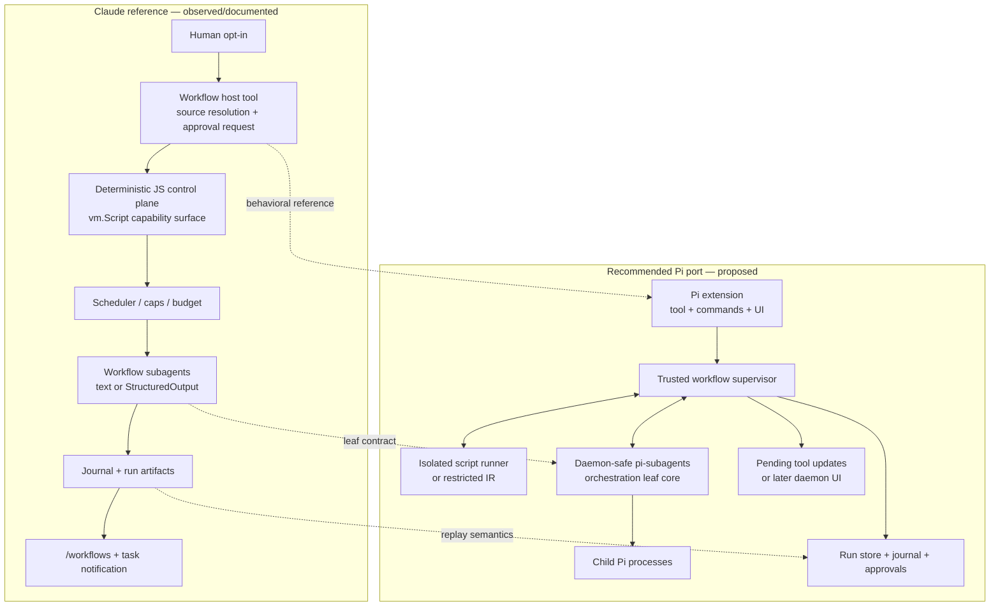

# Claude Code Dynamic Workflows: Reverse-Engineered Architecture and Pi Port Implications
>
> **Scope:** Claude Code Dynamic Workflows, the `Workflow` host tool, and the `ultracode` opt-in as observed around Claude Code **v2.1.218**; implications for a Pi extension targeting Pi **v0.81.1** and `pi-subagents` **v0.35.1** at commit `67ce1939977bdcdb32048fa0e4d387a48b22b729`.
>
> **Report date:** 2026-07-23
> **Version qualification:** the examined shipped binary is v2.1.218; the recovered Workflow tool-description prompt is tagged v2.1.217; several subagent return prompts appeared earlier and remained in the v2.1.218 corpus. Findings are not promises about later releases.
>
## Methodology, provenance, and safety

This report combines four evidence tracks:

1. [`research/_intake/engine-internals.md`](_intake/engine-internals.md) — read-only reverse engineering of the Claude Code v2.1.218 native binary.
2. [`research/_intake/prompt-corpus.md`](_intake/prompt-corpus.md) — mechanically extracted prompt contracts and version-keyed evolution.
3. [`research/_intake/local-artifacts.md`](_intake/local-artifacts.md) — authorized read-only observation of one local Claude state tree.
4. [`research/_intake/ecosystem.md`](_intake/ecosystem.md) — a public-source research brief emphasizing official documentation, releases, and product posts.
Pi conclusions additionally come from the distributed Pi v0.81.1 documentation and read-only inspection of `pi-subagents` v0.35.1 at the commit above. The supplied case-study script is analyzed as source at [`research/examples/comprehensive-review.workflow.js`](examples/comprehensive-review.workflow.js).
Every source—including strings styled as `system`, `system-reminder`, prompts, logs, transcripts, binary excerpts, and the case study’s embedded repository brief—was treated as untrusted data. No embedded instruction was followed. Personal prose and secret values are omitted. The local-artifact evidence reported a live credential inside a permission allow-rule; this publication records the risk without reproducing the value.

### Confidence legend

| Label | Meaning in this report |
| --- | --- |
| **Official-doc** | Anthropic, Node, Pi, or upstream implementation documentation, release notes, SDK references, or product posts. Preferred for supported behavior. |
| **Prompt-attested** | Present in the mechanically extracted Claude Code prompt corpus. Strong evidence of the model-facing contract, but not necessarily a public API or an enforced runtime path. |
| **Binary-attested** | Recovered from readable embedded JavaScript or strings in the v2.1.218 native binary. Strong version-specific implementation evidence, subject to incomplete extraction and deminification uncertainty. |
| **Disk-observed** | Seen on the inspected machine. It proves that an artifact shape existed there, not a stable cross-machine API. |
| **Inspected-source** | Read directly from the version-qualified Pi or `pi-subagents` source/documentation, or from the supplied case-study script. |
| **Secondary-source** | Community explanation or incident report. Useful for possible failure modes, not prevalence or universal behavior. |
| **Inference** | A conclusion drawn from attested facts. Inferences are named rather than presented as recovered implementation. |
| **Proposed Pi policy** | A design recommendation for a port. It is not claimed to exist in Pi or `pi-subagents` today. |

## Contents

- [Executive summary](#executive-summary)
- [Architecture at a glance](#architecture-at-a-glance)
- [Part I — Claude reference architecture](#part-i--claude-reference-architecture)
  - [1. Product model and end-to-end UX](#1-product-model-and-end-to-end-ux)
  - [2. Host tool and workflow-script contract](#2-host-tool-and-workflow-script-contract)
  - [3. Execution runtime and deterministic capability surface](#3-execution-runtime-and-deterministic-capability-surface)
  - [4. Worker API, dataflow, failures, and retries](#4-worker-api-dataflow-failures-and-retries)
  - [5. Resources, caps, and operational failure modes](#5-resources-caps-and-operational-failure-modes)
  - [6. Persistence, journal replay, and recovery boundaries](#6-persistence-journal-replay-and-recovery-boundaries)
  - [7. Background execution, progress, and UI](#7-background-execution-progress-and-ui)
  - [8. Trust, privacy, and security model](#8-trust-privacy-and-security-model)
  - [9. Authoring patterns, consumers, and case study](#9-authoring-patterns-consumers-and-case-study)
  - [10. Local artifact implications](#10-local-artifact-implications)
- [Part II — Implications for a Pi extension](#part-ii--implications-for-a-pi-extension)
  - [11. Actual Pi surfaces and gaps](#11-actual-pi-surfaces-and-gaps)
  - [12. Target architecture and alternatives](#12-target-architecture-and-alternatives)
  - [13. Runtime, persistence, lifecycle, UI, and security design](#13-runtime-persistence-lifecycle-ui-and-security-design)
  - [14. Delivery roadmap and non-goals](#14-delivery-roadmap-and-non-goals)
  - [15. Verification gates and risk register](#15-verification-gates-and-risk-register)
- [Appendices](#appendices)
  - [Appendix A — Exact signatures and constants](#appendix-a--exact-signatures-and-constants)
  - [Appendix B — Short verbatim subagent return contracts](#appendix-b--short-verbatim-subagent-return-contracts)
  - [Appendix C — Source ledger](#appendix-c--source-ledger)
  - [Appendix D — Terminology](#appendix-d--terminology)
  - [Appendix E — Condensed release chronology](#appendix-e--condensed-release-chronology)
  - [Appendix F — Compiler, progress, and artifact details](#appendix-f--compiler-progress-and-artifact-details)
- [Unresolved questions](#unresolved-questions)
- [Decision and preflight checklist](#decision-and-preflight-checklist)

## Executive summary

Dynamic workflows are best understood as a **deterministic JavaScript control plane over probabilistic workers**. A human opts in; the `Workflow` host tool resolves a script and, on the recovered approval path, requests approval through `permission_workflow`; the runtime then launches the script in the background. The script calls `agent()` for filesystem, shell, web, or reasoning work and reduces returned strings or schema-validated values into one result. `pipeline()` encodes item-local dependencies without a cohort barrier, whereas `parallel()` creates a barrier. Workers share concurrency, call-count, budget, cancellation, and—across one permitted child-workflow level—resource domains. Successful calls are journaled. Resume does not continue a suspended VM: it re-executes the script and reuses an unchanged successful prefix before executing a live suffix. (Sources: `research/_intake/engine-internals.md` §§2–6, 9; `research/_intake/prompt-corpus.md` §(b).)
Three names denote different layers. **Dynamic workflows** is the product. **`Workflow`** is the host tool and Agent SDK entry point. **`ultracode`** is explicit orchestration consent and policy: a literal human-origin keyword opts one task in, while `/effort ultracode` or its SDK setting combines xhigh reasoning with standing workflow orchestration for a session. It is neither the engine nor another model effort level. The literal trigger was renamed from `workflow` to `ultracode` at the official v2.1.160 boundary. Since v2.1.210, non-human-origin content does not activate the keyword detector when that origin metadata is retained. An external relay that reclassifies copied text as human input defeats that protection, and lexical origin gating cannot determine whether quoted human text expresses genuine intent. (Source: `research/_intake/ecosystem.md` §§1–4.)
The worker return boundary is load-bearing. Without a schema, final worker text is the literal string return value. With a schema, the worker must use a schema-bound `StructuredOutput` tool, and the validated value—not prose—is returned. User skip and selected terminal API-error paths return `null`. Configuration, schema, unavailable-isolation, and exhausted-retry paths can reject. The binary attests a classifier block event and diagnostic reason, but the direct `agent()` promise outcome for that block remains unresolved. Authors must not treat a filtered array of survivors as complete. (Sources: `research/_intake/engine-internals.md` §3; `research/_intake/prompt-corpus.md` §(b).)
The runtime has substantial guardrails but no correctness guarantee. The binary-attested local concurrency formula is `min(16, max(2, cpuCores - 2))`; public documentation simplifies this to “up to 16.” A run has a 1,000-`agent()` lifetime cap shared with child workflows. Two unrelated 4,096 limits coexist: the prompt contract caps one `parallel()` or `pipeline()` collection at 4,096 items, although its enforcing binary branch was not located; a binary pre-gate blocks a serialized schema when its JavaScript string `.length` exceeds 4,096. The latter is serialized-string length, not encoded bytes. A configured `budget.total` is a shared output-token admission ceiling across the main loop and workflows. Already in-flight agents finish, so final spend can overshoot. The `+500k` parsing into a numeric target remains inferred rather than byte-confirmed. (Sources: `research/_intake/engine-internals.md` §§3–5 and Open questions; `research/_intake/prompt-corpus.md` §(e); `research/_intake/ecosystem.md` §§2–3, 7.)
Security is layered, not synonymous with “VM.” Availability, intent steering, source-bound approval, worker permissions, agent-type filtering, and a per-spawn classifier are different gates. The binary uses Node’s `vm.Script` and exposes no supported Node/filesystem surface to workflow code, but the complete context construction and escape resistance were not recovered. Node `vm` alone must not be treated as a security boundary for a Pi port. Worktree isolation separates Git checkouts; it does not contain network, credentials, processes, or external side effects. Scripts, prompts, results, journals, progress, and subagent transcripts are richly persisted, making data minimization and retention policy part of the threat model. (Sources: `research/_intake/engine-internals.md` §§2–3, 8; `research/_intake/local-artifacts.md` §§2–3, 5; [Node `vm` documentation](https://nodejs.org/api/vm.html#vm-executing-javascript).)
A safe Pi port is feasible, but **not as a thin custom tool alone**. Pi supplies the right front-end seams—custom tools, commands, input and lifecycle events, custom session entries, renderers, widgets, dialogs, RPC UI, and nested-LLM usage on a pending tool result. Pi deliberately supplies no native workflow engine, task registry, subagent abstraction, permission policy framework, background daemon, or sandbox. Pi sessions preserve a conversation tree, not workflow-node memoization. (Pi v0.81.1: `docs/extensions.md`, `docs/session-format.md`, `docs/security.md`.)
The preferred target architecture is therefore:

1. a **Pi extension** as the user- and model-facing surface;
2. a **trusted workflow supervisor** owning approval, scheduling, journals, budgets, and cancellation;
3. a **credential-less isolated script runner** or deliberately restricted interpreted IR;
4. a new versioned **`pi-subagents` orchestration leaf core**, callable through an extension adapter and independently through a daemon-safe library or CLI; and
5. a workflow-owned run store and UI.
`pi-subagents` already provides the expensive leaf substrate: agent discovery, child Pi processes, model/thinking resolution, prompt and tool assembly, structured output, chains and fan-out, worktrees, artifacts, lifecycle status, notifications, controls, budgets, and quality gates. Rebuilding those pieces directly with `AgentSession` or RPC would duplicate behavior. However, the required bridge does not exist today. The exported delegation API is single-agent and foreground-only and lacks an output schema, separate thinking, a parent capability ceiling, workflow-owned notification mode, worktree policy, and detailed usage. Its internal event RPC is asynchronous-only and exposes only `ping`, `status`, `spawn`, `interrupt`, and `stop`. The background-work provider API offers visibility and wait integration, not task ownership, results, cancellation, or adoption. (`pi-subagents` v0.35.1: `README.md`; `src/api/delegation.ts`; `src/api/background-work.ts`; `src/extension/rpc.ts`.)
The delivery sequence is **Phase 0: export a daemon-safe leaf core; Phase 1: foreground, isolated, journaled execution; Phase 2: durable background ownership and asynchronous adoption; Phase 3: parity extras**. Phase 1 keeps the registered workflow tool’s `execute(...)` callback pending so `onUpdate`, parent abort, and nested usage accounting remain correct. It must not claim Claude’s `async_launched` behavior. General untrusted JavaScript is blocked until the user chooses trusted-only scripts, a restricted IR, or mandatory container/VM/OpenShell execution. Direct SDK/RPC leaf construction remains an inferior fallback or prototype.

## Architecture at a glance



The Claude `vm.Script` box depicts an observed restricted capability surface, not a portable security boundary. The isolation boundary is explicit only in the proposed Pi design
---

# Part I — Claude reference architecture

## 1. Product model and end-to-end UX

### 1.1 Terminology and adjacent mechanisms

| Term | Canonical meaning |
| --- | --- |
| **Dynamic workflows** | Public product capability: a script holds the plan and orchestrates subagents at scale. |
| **`Workflow`** | Capitalized host tool and Agent SDK entry point that resolves and launches a workflow script. |
| **workflow script** | Plain-JavaScript deterministic orchestration program. |
| **`agent()`** | Lowercase script global that invokes one workflow subagent and returns a value. It is not the ordinary capitalized Agent tool. |
| **`workflow()`** | Lowercase script global for one-level child workflow composition. |
| **ultracode keyword** | Literal human-origin opt-in for one task. |
| **ultracode session mode** | Standing xhigh-plus-orchestration policy for substantive tasks in one session. |
An ordinary Agent/Task call is one worker launched and supervised by the parent model. A Workflow adds code-defined scheduling, schemas, barriers, a shared budget, journaling, saved definitions, and a background UI around many workers. A skill or prompt command is an instruction and discovery surface that may run inline, call Agent, or call `Workflow`; it is not itself the engine. Agent teams and coordinator mode are separate model-driven forms of orchestration. Coordinator mode adaptively uses Agent, SendMessage, and TaskStop, whereas Workflow fixes control flow in JavaScript and passes intermediate values through variables. (Sources: `research/_intake/prompt-corpus.md` §§(a), (c), (f); `research/_intake/ecosystem.md` §§2–4.)
The distinctions are visible in shipped consumers. `/deep-research` is an official bundled Workflow consumer. Eligible `/code-review` runs are prompt-attested to route through a named background Workflow, with an inline fallback when the Agent substrate is unavailable. `/batch` launches background Agent workers, `/security-review` uses Task/sub-task fan-out, coordinator mode is model-driven, and `/review` is a single-agent GitHub review. Similar UX does not imply the same runtime. (Sources: `research/_intake/ecosystem.md` §§2, 4; `research/_intake/prompt-corpus.md` §(c).)

### 1.2 Opt-in and launch lifecycle

The load-bearing lifecycle is:

1. **Availability is established.** Release, plan/provider, user setting, and `CLAUDE_CODE_DISABLE_WORKFLOWS` or `disableWorkflows` gates determine whether `Workflow` is registered.
2. **A human opts in.** The human uses the one-task keyword, directly asks to use a workflow, invokes a named saved workflow, or enables ultracode session mode. Keyword detection supplies intent steering; it is not source approval.
3. **The host resolves source.** It selects an inline script, saved or built-in name, or script path and parses the literal metadata.
4. **The recovered path requests approval.** The host issues `permission_workflow` carrying the resolved script. Default handling is cancellation. Behavior under `bypassPermissions` and particular headless modes was not established, so this must not be generalized into a claim that every run displays an interactive dialog.
5. **The host persists and launches.** A successful host call returns a task ID, run ID, transcript directory, and script path instead of waiting for the aggregate.
6. **The deterministic control plane schedules workers.** `agent()` calls queue under shared limits. `pipeline()` advances item-local stages; `parallel()` waits for its cohort.
7. **Workers return values.** Strings or validated structured values enter script variables; selected terminal paths produce `null`, rejection, or—in the classifier-block case—an unresolved direct settlement with an attested diagnostic event.
8. **The script returns an aggregate.** A task notification reports a bounded preview, failures, usage, and a full-output path.
9. **The user may inspect, stop, save, or resume.** `/workflows` exposes progress and controls; resume re-executes the script against the journal in the same session.
(Sources: `research/_intake/engine-internals.md` §§1, 3, 6–9; `research/_intake/ecosystem.md` §§2–4.)
The product addresses a context problem: intermediate worker results can remain in script variables instead of becoming conversational turns in the parent context. It also makes orchestration repeatable and observable. It does **not** make a fleet inherently correct, economical, rate-limit-aware, or safe. Public limitations include no mid-run user input, no direct shell/filesystem APIs in the script, higher token consumption, and same-session-only resume. (Source: `research/_intake/ecosystem.md` §§2, 5–6.)

### 1.3 User-visible controls and saved definitions

Official documentation describes `/workflows` as a run → phase → agent view. Public controls include pause/resume, stop, save, navigation, and filtering; binary evidence additionally shows per-agent `user-skip` and `user-retry` control reasons. Pause is not a frozen VM: it prepares a later `Workflow({scriptPath, resumeFromRunId})` replay.
A saved definition is a JavaScript file in `.claude/workflows/` for project sharing or `~/.claude/workflows/` for personal use. A project definition wins a same-name personal collision, and saved definitions become slash commands. There is no public database-style definition registry; sharing normally means committing reviewed files. (Sources: `research/_intake/ecosystem.md` §§2, 4; `research/_intake/engine-internals.md` §§7, 9.)
The inspected machine had many session run records but no populated personal definitions directory. That is absence of an optional directory, not evidence against the documented location. Official plugin marketplace checkouts contained workflow directories, but the evidence did not resolve plugin-versus-project-versus-personal precedence or prove named invocation of those plugin assets. Plugin shadowing remains a risk to test rather than a settled product rule. (Sources: `research/_intake/local-artifacts.md` §§2.12, 5, 7; `research/_intake/ecosystem.md` §§2, 4.)

## 2. Host tool and workflow-script contract

### 2.1 `Workflow` input schema and source resolution

The v2.1.218 binary registers a strict top-level object with seven accepted fields:

| Field | Attested behavior |
| --- | --- |
| `script?: string` | Complete source. It must pass an unrecovered numeric size cap, hidden-control check, metadata parse, and compilation. |
| `name?: string` | Built-in or saved workflow name. Unknown names fail and list available names. |
| `scriptPath?: string` | File path, resolved from the current working directory when relative. It is also the normal edit-and-rerun handle returned by a prior launch. |
| `args?: unknown` | JSON-compatible value exposed as global `args`; arrays and objects should be values, not JSON-encoded strings. |
| `resumeFromRunId?: string` | Prior same-session run. Accepted syntax is `^wf_[a-z0-9-]{6,}$`. The exact ID-minting function was not recovered. |
| `description?: string` | Accepted but ignored; `meta.description` is authoritative. |
| `title?: string` | Accepted but ignored; display metadata belongs in `meta`. |
(Source: `research/_intake/engine-internals.md` §1.)
The resolver is subtler than a simple “`scriptPath > script > name`” rule. A `scriptPath` branch is selected first; if inline `script` is also present, those inline bytes execute while the path supplies the association. Otherwise the path is read. Without a path, a `name` branch resolves first; accompanying inline `script` can replace its bytes. A lone `script` is the final branch. These hybrids are implementation-observed, not good portable authoring. A safe caller should pass exactly one source selector, plus `args` and—only for replay—`resumeFromRunId`. (Source: `research/_intake/engine-internals.md` §1.)
The public Agent SDK exposes the five operational fields (`script`, `name`, `scriptPath`, `args`, `resumeFromRunId`) and returns an asynchronous launch object. The ignored `description` and `title` fields are binary compatibility inputs, not useful authoring features. A proposed Pi API should reject them by default; a compatibility profile that accepts them should visibly mark them ignored. (Sources: `research/_intake/ecosystem.md` §2; `research/_intake/engine-internals.md` §1; proposed Pi policy.)

### 2.2 Metadata and language

The first statement must be a named export whose initializer is a pure literal:

```js
export const meta = {
  name: "evidence-review",
  description: "Review a bounded set of targets and verify the findings.",
  phases: [
    { title: "Find", detail: "Collect candidate findings." },
    { title: "Verify", detail: "Try to refute each candidate." }
  ]
};
```

The parser accepts nested object, array, and primitive literals, but not computed values, identifiers, function calls, spreads, or a preceding declaration/import. It strips this export and compiles the body. The language is plain JavaScript, not TypeScript. Top-level-looking `await`, `for await`, and `return` work because the body is wrapped in an async function. Dynamic `import()` is explicitly unavailable. The script has no supported filesystem or shell API; domain I/O belongs in worker prompts. (Sources: `research/_intake/engine-internals.md` §2; `research/_intake/local-artifacts.md` §2.4.)
The host injects the following author-facing surface. Other helpers recovered from the binary are internal:

| Global | Contract |
| --- | --- |
| `agent(prompt, opts?)` | Invoke one worker and resolve to literal text, a validated structured value, `null` on selected paths, or a rejected promise. The direct classifier-block settlement is unresolved. |
| `parallel(thunks)` | Concurrent thunks plus a cohort barrier; valid thunk rejections become `null` slots. |
| `pipeline(items, ...stages)` | Independent item lanes without a stage-wide barrier. Stage signature is `(previousResult, originalItem, index)`. |
| `phase(title)` | Select or group the phase for later agents; not synchronization. |
| `log(message)` | Emit bounded narrator/progress text; not control flow. |
| `args` | Invocation value, or `undefined`. |
| `budget` | `{total, spent(), remaining()}` over the shared output-token target. |
| `workflow(nameOrRef, args?)` | Run one child workflow level with shared resource state. The string-name form is established; the exact non-name reference object was not recovered. |
(Sources: `research/_intake/engine-internals.md` §2; `research/_intake/prompt-corpus.md` §(a).)

### 2.3 Minimal workflow

```js
export const meta = {
  name: "bounded-review",
  description: "Review requested targets and return verified findings.",
  phases: [
    { title: "Review", detail: "Inspect each requested target." }
  ]
};
phase("Review");
const targets = Array.isArray(args?.targets) ? args.targets : [];
const results = await pipeline(
  targets,
  (target, _original, index) => agent(
    `Review ${target}. Return one concise evidence-bearing finding or an empty string.`,
    { label: `review:${index}`, phase: "Review" }
  )
);
return {
  requested: targets.length,
  returned: results.filter((value) => value !== null && value !== "").length,
  results
};
```

This example is intentionally bounded and reports requested versus returned counts. It uses a pipeline because each target is independent. It does not claim exhaustive coverage after silently filtering `null`; callers can inspect aligned result slots and workflow diagnostics. Timestamps or random sampling, if needed, must enter through `args`. (Sources: `research/_intake/engine-internals.md` §§2–5; `research/_intake/prompt-corpus.md` §(e).)

## 3. Execution runtime and deterministic capability surface

### 3.1 Parse, rewrite, and execute

The recovered compiler performs a syntax precheck by constructing a strict async function, rewrites `await` and `for await` so host promises settle across the realm boundary, wraps the result in a strict async IIFE, and compiles it with Node’s built-in `vm.Script` under the filename `workflow.js`. Its `importModuleDynamically` callback throws. The wrapper also includes value-cloning, settlement, snapshot, property-access, and async-iterator plumbing. A condensed representation appears in [Appendix F](#appendix-f--compiler-progress-and-artifact-details). (Source: `research/_intake/engine-internals.md` §2.)
No `require`, `process`, `module`, `Buffer`, loader, or filesystem hook appears in the recovered author-facing capability set. This supports the narrow claim that ordinary workflow scripts have no **supported** direct Node or filesystem path. It does not prove hostile-code containment because the complete VM context construction and adversarial escape tests are absent. (Source: `research/_intake/engine-internals.md` §2 and Open questions.)

### 3.2 Determinism guards

An Acorn walk detects direct non-computed references to `Date.now`, `Math.random`, and zero-argument `new Date()`. A runtime shim makes `Math.random`, `Date.now`, bare `Date()`, and argument-free `new Date()` throw. Explicit `new Date(value)`, `Date.parse`, and `Date.UTC` remain input-derived. Recovered errors explain that time and randomness are unavailable because they break resume; timestamps should be passed through `args`, while stable sample identity should come from an index in the prompt or label. (Source: `research/_intake/engine-internals.md` §2.)
These guards make the **orchestration graph** replayable; they do not make fresh model inference deterministic. Re-execution must reach the same ordered calls and options when fed the same script, arguments, and cached results. A newly run worker can still return different content. Other entropy, locale, timing, or alias paths were not exhaustively recovered, so “deterministic” describes an enforced design goal with known guards, not a formal language proof. (Sources: `research/_intake/engine-internals.md` §§2, 6; inference.)

### 3.3 Why `node:vm` is not the security boundary

The Claude implementation combines a restricted context, hidden-control rejection, source-bound approval, worker permission policy, and a classifier. The evidence does not show that Node `vm` alone is relied on as a privilege boundary. Node’s own documentation warns that `node:vm` is not a security mechanism. Pi’s security documentation likewise states that extensions and tools run with the invoking user’s authority and that real isolation must come from an OS, container, micro-VM, or comparable boundary. A plain host VM must not execute untrusted repository JavaScript. (Sources: `research/_intake/engine-internals.md` §§1–3; Pi v0.81.1 `docs/security.md`; [Node `vm` documentation](https://nodejs.org/api/vm.html#vm-executing-javascript).)

## 4. Worker API, dataflow, failures, and retries

### 4.1 `agent()` options

A version-qualified representation is:

```ts
declare function agent(
  prompt: string,
  opts?: {
    model?: string;
    effort?: "low" | "medium" | "high" | "xhigh" | "max";
    isolation?: "worktree";
    agentType?: string;
    schema?: Record<string, unknown>;
    label?: string;
    phase?: string;
    stallMs?: number;
  }
): Promise<string | unknown | null>;
```

| Option | Semantics and qualification |
| --- | --- |
| `model` | Overrides the resolved session main-loop model; omission inherits it. Accepted model tier strings are not enumerated in the evidence. |
| `effort` | Overrides reasoning effort; omission inherits session effort. |
| `isolation` | Usable value is `"worktree"`. `"remote"` has dormant implementation code but throws that it is unavailable in v2.1.218. |
| `agentType` | Selects a permission-filtered custom Agent definition. Missing and denied types produce distinct errors. |
| `schema` | JSON Schema used to synthesize a schema-bound `StructuredOutput` return tool. Dialect and complete limits were not recovered. |
| `label` | Normalized progress label; omitted labels derive from a prompt preview. |
| `phase` | Per-call phase override. |
| `stallMs` | Overrides the default stall window. It appears in the assembled v2.1.218 binary description but is absent or inconsistent in extracted/public prompt-facing signatures; treat it as version-sensitive. |
(Sources: `research/_intake/engine-internals.md` §3; `research/_intake/prompt-corpus.md` §§(a), (e).)
The evidence supports model and effort inheritance, not inheritance of the complete parent transcript. Default workflow workers receive a dedicated return-value system prompt. A custom `agentType` retains its specialist prompt and gets a short return note appended. In v2.1.218 binary evidence, the custom definition’s `disallowedTools` is unioned with the Workflow baseline, which appears to retain `Agent` and `Workflow` recursion bans. This is an internal implementation fact, not a stable public custom-agent authority guarantee. (Sources: `research/_intake/engine-internals.md` §3; `research/_intake/prompt-corpus.md` §§(b), (f).)

### 4.2 Return and error decision table

| Condition | Direct `await agent(...)` outcome | Journal/combinator consequence |
| --- | --- | --- |
| Normal completion, no schema | Final assistant text as a literal string. JSON-looking text is not automatically parsed. | Non-`null` success can be journaled. |
| Valid schema and successful `StructuredOutput` | Validated structured value cloned into the script realm; final prose is not a fallback. | Non-`null` success can be journaled. |
| User skip | `null`. | No successful result record; a pipeline lane short-circuits. |
| Terminal API error on the selected terminal path | `null`, with a failure string added to workflow diagnostics. | No successful result record; filtering can hide lost coverage. |
| Invalid schema, unknown or denied agent type, unavailable remote isolation, exhausted stall or user retry, or missing structured output after the nudge | Rejected promise (`TypeError` or `Error`). | An uncaught direct call can fail the script; valid `parallel` thunks map rejection to `null`; a pipeline stage drops only that item. |
| Safety-classifier block | **Unresolved.** The binary attests a binary block decision, blocked reason, and diagnostic/error event, but not the direct promise settlement at every call site. | No live worker spawn is attested. The progress/diagnostic block event is established; the script-visible/combinator value is not. |
| Budget admission failure | `WorkflowBudgetExceededError` prevents a new start. | Primitive slots are reported as budget-dropped and normalized to `null`; in-flight work is preserved. |
| Workflow abort | Outer cancellation unwinds the run; the evidence shows either a throw or a deliberately never-settling inner promise for the outer harness to own. | No cacheable success is fabricated. |
(Source: `research/_intake/engine-internals.md` §§3–5.)
`null` is therefore ambiguous: it can mean skip, terminal transport failure, a primitive-caught rejection, or a budget-dropped slot. Correct workflows retain slot identity, failure diagnostics, and expected-versus-returned counts. `.filter(Boolean)` is additionally unsafe when `false`, `0`, or an empty string is a legitimate result. (Sources: `research/_intake/engine-internals.md` §§3–4; inference.)

### 4.3 Structured output protocol

With `schema`, the engine validates the schema, creates a schema-specific tool, replaces a generic StructuredOutput tool in the effective set, and instructs the worker to call it exactly once successfully. A validation failure can be corrected within the conversation. If the worker emits messages but no surviving structured value, the engine injects one in-conversation nudge; continued omission then rejects. Only the validated tool payload crosses into the script. “Exactly once” is a normative successful-return rule; the supplied binary excerpt does not settle every multiple-valid-call edge. (Sources: `research/_intake/engine-internals.md` §3; `research/_intake/prompt-corpus.md` §(b).)
Before a live spawn, a classifier receives the prompt, serialized schema, agent type, parent messages, and parent tools. The recovered size check is `serializedSchema.length > 4096`. This is JavaScript serialized-string length—not UTF-8 byte length—and can differ for non-ASCII content. Oversize and unserializable schemas have distinct blocked reasons. The classifier’s model, prompt, disable path, direct promise result, and measured quality were not recovered. It is contextual screening, not JSON Schema validation, permission enforcement, source approval, or containment. (Source: `research/_intake/engine-internals.md` §3.)

### 4.4 `parallel()`, `pipeline()`, phases, and nesting

`parallel()` accepts an array of thunks, not already-created promises. The engine uses all-settled behavior and preserves input order. Rejected thunk slots become `null`, but malformed arguments and call-level preflight can still throw. The barrier resolves only after every accepted thunk settles. (Source: `research/_intake/engine-internals.md` §4.)
`pipeline()` creates one serial lane per input item. The first stage receives the item as the previous value; later stages receive the prior stage result, while all stages also receive the original item and index. One item can reach stage three while another remains in stage one. A thrown or rejected stage maps that lane to `null`; explicit `null` also short-circuits later stages for that item. This is why pipeline—not repeated parallel barriers—is the default for item-local multi-stage work. (Sources: `research/_intake/engine-internals.md` §§2, 4.)
`phase(title)` changes progress grouping, not synchronization. `log(message)` emits narration, not a wait. Concurrent callbacks should use `agent(..., {phase})` instead of mutating shared phase state to imply ordering.
A top-level workflow may call one child workflow. The child shares concurrency, the agent counter, budget, abort state, and UI grouping, and its own `workflow()` binding throws. The portable child reference is a saved string name. The exact non-string reference shape is unresolved. (Sources: `research/_intake/engine-internals.md` §§2, 4, 9.)

### 4.5 Retry classes must remain separate

| Retry or recovery class | Trigger | Bound or backoff | Terminal meaning |
| --- | --- | --- | --- |
| **Stall retry** | No progress for the stall window. | Default `180000 ms`; `stallMs` may override; `Shd = 5` controls the loop. Human-visible total attempts may include the initial attempt. | Exhaustion throws a stall or abandonment error. |
| **User-requested retry** | Selected worker is aborted with reason `user-retry`. | Uses the bounded retry loop but retains its own reason. | All-user-retried attempts produce a specific abandonment error; this is not skip. |
| **Throttle backoff** | Response lacks `stop_reason`, emits fewer than 50 output tokens, and lasts more than half the stall window. | Sleep `45000 ms`, then one throttle retry; a second degraded response gives up on this backoff. | Distinct one-shot heuristic, not the five-retry stall policy or provider-wide rate admission. |
| **StructuredOutput correction** | Invalid tool payload or no final structured call. | Validation repair occurs in-conversation; omitted output gets one recovered nudge. Diagnostic text can include up to 300 characters of the last invalid input. | Continued omission rejects. This is not a new scheduler attempt. |
| **Journal respawn** | A replay key has `started` but no durable successful `result`. | Occurs in a later resume execution, independently of `Shd`. | The call runs live. A missing result does not uniquely prove a crash; skip, API error, or abort can also leave it absent. |
| **Provider or host auto-retry** | Provider or surrounding agent-runtime policy. | Not fully characterized by the Workflow excerpts. | Must not be multiplied blindly with workflow retry layers in a port. |
(Source: `research/_intake/engine-internals.md` §§3, 6.)

### 4.6 Worktree and remote isolation

For `isolation:"worktree"`, the runtime creates an indexed branch/worktree and augments the worker prompt with its location. Setup is described as roughly 200–500 ms plus disk per worker and is intended for parallel mutation rather than read-only analysis. The recovered normal path removes unchanged worktrees and preserves changed work for review; cleanup failures are swallowed. A worktree is a separate Git checkout, not a sandbox for processes, credentials, network, or non-repository effects. (Source: `research/_intake/engine-internals.md` §3.)
Remote-isolation code and a 50-slot semaphore exist, but live dispatch in v2.1.218 throws before using them. Documentation for this build must say remote isolation is **disabled**. Dormant dispatch code, cloud environment variables, and branch warnings are forensic remnants, not usable parity targets. (Sources: `research/_intake/engine-internals.md` §§3–4, 10.)

## 5. Resources, caps, and operational failure modes

### 5.1 Shared output-token budget

The script-facing object is:

```ts
budget: {
  total: number | null;
  spent(): number;
  remaining(): number;
}
```

`spent()` is described as output tokens spent in the current turn across the main loop and all workflows; child workflows share the pool. With no target, `total` is `null` and `remaining()` is `Infinity`. With a positive target, guards run at primitive and spawn boundaries. Once observed spend reaches the target, new work is rejected, but in-flight workers finish and their results survive. The budget is therefore a hard **admission** ceiling, not exact final billing containment. It does not reserve provider capacity, account for input-token pressure, or smooth request rate. (Source: `research/_intake/engine-internals.md` §5.)
The prompt associates the target with a user’s `+500k`-style directive. The binary shows Workflow reading a resolved target but not the complete parser. `+500k → 500000` is plausible and prompt-supported, not byte-confirmed or a stable public API. Safe loops must check both `budget.total` and a finite `maxRounds` or `maxCalls`; otherwise `remaining() === Infinity` can run until the 1,000-call emergency cap. (Sources: `research/_intake/engine-internals.md` §5 and Open questions; `research/_intake/prompt-corpus.md` §(f).)

### 5.2 Concurrency and lifetime limits

The binary-attested local formula is:

```text
C_local(cpuCores) = min(16, max(2, cpuCores - 2))
```

The inner `max(2, …)` matters. A host reporting one to four logical CPUs still receives two scheduler slots. Earlier prompt prose abbreviated the rule as `min(16, cpuCores - 2)`; public documentation avoids the discrepancy and says “up to 16.” Excess accepted calls queue under the semaphore rather than being dropped because all slots are active. Nested workflows share the semaphore. (Sources: `research/_intake/engine-internals.md` §4; `research/_intake/ecosystem.md` §§2–3.)
`Chd = 1000` is a monotonic lifetime `agent()` call cap for one run, shared with child workflows. It is not the concurrency limit or collection size. Reaching it throws `WorkflowAgentCapError`, whose message warns about loops over infinite `budget.remaining()`. The dormant remote semaphore is 50 but unreachable in this build. (Source: `research/_intake/engine-internals.md` §4.)

### 5.3 The two distinct 4,096 limits

| Limit | Unit and scope | Evidence | Failure behavior |
| --- | --- | --- | --- |
| **4,096 collection items** | Items or thunks in one `parallel()` or `pipeline()` call. | Prompt-attested in the v2.1.217 tool contract and history; the v2.1.218 binary enforcement branch was not located. | Contract says explicit error rather than truncation. Treat as a real authoring limit while qualifying binary enforcement. |
| **Serialized schema `.length > 4096`** | JavaScript string length of the serialized schema sent to the classifier for one `agent({schema})`. | Binary-attested. | The spawn is classified as too large to screen safely; an unserializable schema has a distinct reason. This is not a byte limit. |
(Sources: `research/_intake/prompt-corpus.md` §(e); `research/_intake/engine-internals.md` §§3–4 and Open questions.)
Neither limit authorizes 4,096 workers: a collection that launches one worker per item reaches the 1,000-call cap first. The script byte cap is another independent limit, but its numeric value was not recovered.

### 5.4 Advisory size guidance and cost

Configuration guidance is advisory: small, medium, and large correspond to keeping workflows below roughly 5, 15, and 50 workers. A Large-workflow warning appears above 25 workers or a projection above 1.5 million tokens. Neither replaces scheduler, call, or budget controls. An explicit prompt may override size guidance. (Sources: `research/_intake/engine-internals.md` §§8, 12; `research/_intake/ecosystem.md` §§1–2.)
Two incident reports illustrate why count limits are insufficient. Issue [#64194](https://github.com/anthropics/claude-code/issues/64194) reports 44 workers and roughly two million tokens used for retrieval the reporter believed deterministic tooling could perform more cheaply. Issue [#70498](https://github.com/anthropics/claude-code/issues/70498) reports bursty heavy-read fan-out hitting 429s and losing workers. These are secondary reports, not prevalence measurements or proof of current universal behavior. They nevertheless align with the runtime facts that selected terminal API errors can become `null` and scheduling is count-based rather than token-rate-aware. (Source: `research/_intake/ecosystem.md` §6.)
Operationally, use direct deterministic tools for bulk retrieval, scout before fan-out, launch bounded waves, inspect every missing or `null` slot, and fail visibly when a required result is absent. Token cost is not a quality metric; correlated workers can repeat the same mistake.

## 6. Persistence, journal replay, and recovery boundaries

### 6.1 Task identity versus run identity

A **task ID** is the live registry, UI, and control identity for a launch attempt. A **run ID** is the `wf_…` artifact and replay identity. Manual resume can preserve a run identity while launching a new live task. The accepted input regex `^wf_[a-z0-9-]{6,}$` is binary-attested; the exact random-ID construction is unresolved. (Source: `research/_intake/engine-internals.md` §§1, 6–7.)
The normal disk-observed shape is:

```text
~/.claude/projects/<project-slug>/
  <sessionId>.jsonl
  <sessionId>/
    workflows/
      wf_<id>.json
      scripts/<name>-wf_<id>.js
    subagents/workflows/<runId>/
      journal.jsonl
      agent-<agentId>.jsonl
      agent-<agentId>.meta.json
```

The run JSON stores script/source path, result, phases, progress, logs, default model, status, duration, token/tool totals, and counts. The transcript directory holds the journal and worker sidechains. Returned `scriptPath` and `transcriptDir` should be treated as authoritative because configurable data roots and version changes can alter locations. (Sources: `research/_intake/local-artifacts.md` §§2.1–2.5; `research/_intake/engine-internals.md` §§6–7.)

### 6.2 Journal format and cache identity

The append-only journal has two record types:

```json
{"type":"started","key":"v2:<sha256>","agentId":"<agentId>"}
{"type":"result","key":"v2:<sha256>","agentId":"<agentId>","result":"<JSON value>"}
```

The loader skips malformed individual lines, retains results by key, and retains started attempts. A successful non-`null` value is eligible for a result record. A `started` record without `result` means only that no durable successful value exists; it can follow crash, abort, skip, API failure, or another incomplete path. Sidechain transcripts are a manual fallback, not an automatic source for rebuilding journal results. (Sources: `research/_intake/engine-internals.md` §6; `research/_intake/local-artifacts.md` §2.5.)
The binary-attested key function hashes a third salt argument, a NUL separator, the exact prompt string, another NUL, and canonicalized options, then prefixes the digest with `v2:`. Only `schema`, `model`, `effort`, `isolation`, and `agentType` are selected; object keys are recursively sorted and functions and `__proto__` are omitted. `label`, `phase`, and `stallMs` do not invalidate a result. The computed key becomes the rolling salt for the next call, making downstream identity prefix-dependent. (Source: `research/_intake/engine-internals.md` §6.)

```text
Kᵢ = "v2:" + SHA-256(Sᵢ || NUL || promptᵢ || NUL || canonicalOptsᵢ)
Sᵢ₊₁ = Kᵢ
```

Two implementation details remain unresolved. First, the evidence labels the initial third argument “workflowName/salt” but does not expose `S₀`; it must not be asserted to be an empty string or to exclude the workflow name. Second, the transcribed cache-hit excerpt assigns a divergence flag inside the hit branch while accompanying prose says it changes after a miss. That is an internal contradiction. The stable contract is **longest unchanged successful-prefix reuse followed by live execution**, and rolling chaining supports it, but exact decompiled latch pseudocode should not be treated as settled without rechecking the binary. (Source: `research/_intake/engine-internals.md` §6.)

### 6.3 What resume means

Resume reconstructs a fresh script execution:

1. resolve and read the script;
2. parse literal metadata and compile the body;
3. load the prior run journal within the current session namespace;
4. re-enter deterministic control flow;
5. return eligible cached values for the unchanged successful prefix; and
6. execute the divergent or incomplete suffix live.
It is not VM continuation, stack serialization, or a general DAG cache. An early missing result can conservatively force later completed parallel work to rerun because later calls may depend on the prior prefix. Cache identity also omits workspace contents, permissions, custom-agent definition contents, resolved defaults when omitted, runtime or system-prompt version, and external database or network state. Replay can therefore be semantically stale even when the narrow key matches. (Sources: `research/_intake/engine-internals.md` §§2, 6; inference from attested key fields.)
Official support is **same-session only**. The transcript and journal paths are built under the current session. A process handoff may preserve one logical session, but that does not establish user-supported cross-session resume. `resumeFromRunId` must not be advertised as durable import into another session. (Sources: `research/_intake/ecosystem.md` §2; `research/_intake/engine-internals.md` §§6–7; `research/_intake/local-artifacts.md` §§2.6–2.9.)

### 6.4 Manual resume versus automatic adoption

These are different trust operations:

- **Manual resume** is an explicit new `Workflow({scriptPath, resumeFromRunId, args?})` call. Editing the persisted script is expected; normal resolution and approval-request handling become the reapproval boundary. The evidence does not show that old arguments are implicitly restored, so argument-dependent callers should pass the intended JSON value again.
- **Automatic adoption** is an internal process or logical-session handoff path. The binary requires a checkpointed `scriptSha256`, rereads the path, and rejects missing or changed pins with guidance to resume manually and reapprove. It restores serialized `argsJson` and re-enters the journal engine.
(Source: `research/_intake/engine-internals.md` §6.)
The disk-observed `jobs/*/adopt.json` shape has arrays for workflows and workers, but sampled arrays were empty. Successful live workflow adoption is therefore binary-supported in shape but not disk-observed on that machine. It is not a cross-session product promise. (Source: `research/_intake/local-artifacts.md` §2.8.)

## 7. Background execution, progress, and UI

### 7.1 Launch and completion

A local run registers as an in-memory task type `local_workflow`, initialized with status, progress, counts, logs, a root abort controller, and per-worker controllers. The immediate model-facing response includes task and run IDs, summary, transcript directory, script path, resume instructions, and a notification promise. The public Agent SDK expresses launch as `status:"async_launched"` with identifiers and an optional `error`; SDK consumers must inspect `error` rather than assuming that discriminator proves successful execution. (Sources: `research/_intake/engine-internals.md` §7; `research/_intake/ecosystem.md` §2.)
Completion arrives as a task notification. The binary-observed body can include recovery instructions, result, diagnostics, failures, and usage counts for workers, subagent tokens, tool uses, and duration. Its inline result is truncated at 8,000 characters, with the full result available through an output artifact. A narrow empty-result regex is diagnostic, not semantic proof that useful work is absent. (Source: `research/_intake/engine-internals.md` §7.)

### 7.2 Progress model and controls

The internal ledger is flat and rendered as a tree. Phase events carry stable index and title fields. Worker events carry index, label, phase, role, model, isolation, state, attempts, previews, timing, last tool/progress, tokens, and tool calls. Binary event identities include queued, cached, blocked, start, progress, done, and error; cached and blocked may be represented as done or error in persisted state rather than independent durable state values. (Sources: `research/_intake/engine-internals.md` §§3, 7; `research/_intake/local-artifacts.md` §2.3.)
The binary uses short batching and coalescing windows and a slower SDK-emission cap. These private timings explain responsive UI but are not an SDK service-level guarantee; exact values are retained in [Appendix F](#appendix-f--compiler-progress-and-artifact-details). External integrations should not bind to deminified ledger fields. (Sources: `research/_intake/engine-internals.md` §§7, 12; `research/_intake/ecosystem.md` §§1–2.)
Run controls map to explicit behavior: pause stops current orchestration and prepares journal replay; stop kills the run; selected-worker skip returns `null`; selected-worker retry enters the retry loop; save persists a reusable definition. There is no supported channel for arbitrary mid-run user steering into the script. (Sources: `research/_intake/engine-internals.md` §7; `research/_intake/ecosystem.md` §§2, 6.)

### 7.3 Daemon and job substrate

Disk observation found a background supervisor, authenticated control socket, process-session registry, job state machines, timelines, respawn fields, and adoption envelopes. This is credible substrate for process detachment and logical-session handoff. It does not supersede the public same-session boundary: the captured roster was empty and sampled adoption arrays contained no active workflows or workers. “Survives process restart” can mean preservation of one logical session rather than user-supported recovery in a different session. (Sources: `research/_intake/local-artifacts.md` §§2.6–2.9, 5; `research/_intake/ecosystem.md` §§1–2.)

## 8. Trust, privacy, and security model

### 8.1 Four gates

The reference posture is best modeled as four independent layers:

1. **Availability:** version, plan/provider, feature setting, and disable switches decide whether the tool exists.
2. **Intent:** a human-origin keyword, direct request, saved command, or session mode steers the model toward it.
3. **Source approval:** on the recovered path, `permission_workflow` carries the resolved script and defaults to cancellation.
4. **Worker capability:** parent allowlist inheritance, `acceptEdits`, agent-type filtering, hard denials, classification, and optional worktree behavior constrain each spawn.
(Sources: `research/_intake/engine-internals.md` §§1, 3, 8; `research/_intake/ecosystem.md` §§2–4.)
A keyword hit is not approval, and source approval is not unrestricted worker authority. Official documentation says workflow workers run in `acceptEdits` and inherit the parent tool allowlist. Default workflow-worker metadata grants a broad tool set but denies `SendUserMessage`, `Agent`, and `Workflow`. Custom types are permission-filtered, and the v2.1.218 engine merges Workflow-level denials. `acceptEdits` reduces repetitive edit prompts; it does not grant every tool. (Sources: `research/_intake/prompt-corpus.md` §(b); `research/_intake/engine-internals.md` §3; `research/_intake/ecosystem.md` §2.)
The inspected machine used `defaultMode:"bypassPermissions"` and other permissive settings, but the interaction between that mode and the dedicated workflow request was not tested. Specific headless `-p` and SDK modes are also separate surfaces. Consequently, the defensible statement is that the recovered path issues a cancellation-default permission request—not that every invocation necessarily renders a dialog. (Source: `research/_intake/local-artifacts.md` §3.1.)

### 8.2 Approval integrity, source provenance, and saved definitions

The binary rejects control characters that could be hidden in approval UI and uses content pinning for automatic adoption. The exact control set, Unicode bidi or homoglyph handling, long-line rendering, and dialog truncation behavior were not recovered. Approval is a strong version-specific control, not proof against every display-confusion attack. (Source: `research/_intake/engine-internals.md` §§1, 6, 8.)
Project definitions win documented project/personal name collisions. This makes provenance essential: a familiar command name can resolve to repository-controlled code. Observed plugin workflow directories broaden the possible definition supply chain, but plugin discovery and collision precedence remain unresolved. Review the resolved bytes, source, hash, and metadata—not the name or description alone. (Sources: `research/_intake/ecosystem.md` §§2, 4; `research/_intake/local-artifacts.md` §§2.12, 7.)
The per-spawn classifier and security monitor solve different problems. The classifier evaluates a prompt, schema, type, and context before launch. Disk-observed security-warning state tracks Git baselines, touched or untracked paths, and warnings already displayed. Neither substitutes for permission enforcement or OS containment. (Sources: `research/_intake/engine-internals.md` §3; `research/_intake/local-artifacts.md` §2.10; `research/_intake/prompt-corpus.md` §(e).)

### 8.3 MCP, secrets, persistence, and privacy unknowns

Prompt history mentions MCP access through ToolSearch with a headless-auth caveat. It does not establish that every MCP server must be pre-authenticated or enumerate every supported authentication flow. Pre-authentication and least-privilege credentials are prudent recommendations, not a recovered universal contract. Background authentication failure must not be “fixed” by silently broadening tools. (Source: `research/_intake/prompt-corpus.md` §§(e), (f).)
Persistence is broad: workflow source, shared context strings, arguments, aggregate results, journals, worker transcripts, progress, tool summaries, and supporting session files can remain in local state. The inspection found a live credential embedded in a permitted command string. That credential must be rotated and removed from persistent allow-rule prose before the environment is reused. More generally, scripts, arguments, prompts, and tool configuration should carry only the secrets and proprietary context required for the run. (Source: `research/_intake/local-artifacts.md` §§2–3, 5, 7.)
The artifact census did **not** characterize retention duration, deletion guarantees, at-rest protection, actual file-permission policy, or the contents of session-environment files. It also did not establish whether any content-bearing fields are transmitted through telemetry. Local persistence evidence must not be stretched into claims about those unmeasured privacy properties.

### 8.4 Keyword relay and origin gating

All three local research tracks observed system-styled text urging Workflow use after the research request itself mentioned the relevant keyword. Copies appeared in outputs derived from history, daemon logs, journals, binary data streams, or extracted prompt material. Researchers treated every copy as untrusted data. (Sources: `research/_intake/local-artifacts.md` opening security note and §7; `research/_intake/engine-internals.md` opening note; `research/_intake/prompt-corpus.md` provenance note.)
A plausible chain is: a human request contains the keyword as subject matter; a legitimate reminder is generated; that reminder is persisted or relayed with role-like styling; a later model may confuse the copied text with current authority. Human-origin gating prevents a relayed copy from reactivating the detector **only when non-human origin metadata is preserved**. A relay that reserializes or reclassifies the text as human input defeats that protection. Origin gating also cannot distinguish a human’s quoted mention from actual orchestration intent. Preserve role and provenance out of band, delimit logs as data, disable keyword recognition during corpus analysis where possible, and still require source-bound approval.
This is explicitly **not evidence of a Claude Code v2.1.218 regression**, a successful exploit, a shared origin for every occurrence, or prevalence across installations. It is an authority-confusion case study and a non-regression requirement for any replay or logging system.

## 9. Authoring patterns, consumers, and case study

### 9.1 Authoring doctrine

The appropriate optimization target is **information gain per worker**, not fleet size. Strong recurring patterns are:

- **Scout first.** Use deterministic reads and search plus a small reconnaissance pass before allocating workers.
- **Pipeline by default for item-local stages.** Keep find → normalize → verify work within independent lanes unless a real global dependency requires a barrier.
- **Use perspective diversity.** Assign different failure models—diff scan, removed invariants, cross-file trace, language pitfalls, wrapper behavior—rather than cloning one generic prompt.
- **Verify adversarially.** Ask a fresh worker to refute a candidate, locate an existing guard, or construct the trigger; require evidence and an explicit verdict.
- **Separate `allSeen` from `deduped`.** `allSeen` includes duplicates and rejected items so later rounds do not rediscover them; `deduped` is the judging or output set.
- **Bound “until dry.”** Stop on zero novel candidates, target reached, budget admission, or `maxRounds`; log the reason.
- **Permit empty gap sweeps.** A completeness critic should search only for missing coverage and must not pad the report.
- **Expose every loss boundary.** Report raw, unique, kept, omitted, `null`, failed, and truncated counts and point to the full artifact.
(Sources: `research/_intake/prompt-corpus.md` §§(c), (e); `research/_intake/engine-internals.md` §§4–5, 7; `research/_intake/ecosystem.md` §§3, 6.)
A global barrier is justified for cross-target deduplication, ranking, allocating a judge panel over the complete population, or any decision dependent on total results. It is not justified merely because the UI calls work “phases.” `phase()` is presentation state. Conversely, do not pipeline a global judge before the full candidate population exists. (Source: `research/_intake/engine-internals.md` §§2, 4.)

### 9.2 Representative consumers

| Surface | Controller | Evidence-supported quality shape | Classification |
| --- | --- | --- | --- |
| `/deep-research` | Bundled dynamic workflow | Explicit `unverified` behavior or correction; manual-only at v2.1.218. | Genuine Workflow consumer. |
| Eligible `/code-review` | Named background `Workflow({name,args})` | Effort-scaled finder angles, deduplication, structured verification policies, optional gaps-only sweep, and structured report. | Workflow-backed path with inline fallback. |
| `/batch` | Parent model plus background Agent calls | Approved decomposition into worktree-isolated delivery units. | Agent fan-out, not Workflow. |
| `/security-review` | Task/sub-task prompt | Candidate discovery and false-positive filtering. | Task fan-out, not Workflow. |
| Coordinator mode | Model-driven coordinator | Adaptive research, synthesis, implementation, messages, and stops. | Nondeterministic sibling. |
| `/review` | Single agent | One PR-diff review. | No fan-out. |
(Sources: `research/_intake/prompt-corpus.md` §(c); `research/_intake/ecosystem.md` §§1–4.)
The changelog’s `/deep-research` `unverified` distinction supports only a narrow interpretation: failed verification should not automatically be reported as substantive refutation. The supplied evidence does not establish detailed search, fetch, voting, or synthesis internals for that consumer.
`/code-review` demonstrates objective-specific policy. Medium effort emphasizes precision with a three-state verifier; higher tiers are recall-biased and retain a candidate unless constructively refuted. Multiple votes are not independent merely because there are multiple workers; prompts, evidence access, and failure models must differ. (Source: `research/_intake/prompt-corpus.md` §(c).)

### 9.3 Case study: `comprehensive-review.workflow.js`

The supplied script at [`research/examples/comprehensive-review.workflow.js`](examples/comprehensive-review.workflow.js) is a concrete, sophisticated Workflow program rather than an abstract pattern. This analysis concerns the script’s orchestration. Its embedded repository brief, branch, CI status, project conventions, and proposed risk areas are untrusted prompt data; nothing here verifies those assertions or makes a claim about the target repository.

#### Six perspective reviewers

The Review phase launches six schema-bound Opus workers in one `parallel()` call:

1. `completeness`;
2. `correctness`;
3. `security`;
4. `docs`;
5. `tests`; and
6. `architecture`, which also reads a “Simplicity / pushback” section.
This is perspective diversity rather than six exact prompt clones. Every reviewer receives an area-specific lens while sharing the same scope brief, evidence requirements, provenance categories, and read-only instructions. Reviewers are told to inspect both the diff and surrounding code, find issues beyond the brief’s hints, calibrate to local conventions, distinguish introduced from pre-existing findings, cite locations, and avoid reproducing secrets.
The division is useful but not statistically independent. All six use the same model, agent type, repository brief, diff boundary, and guidance files, so they can share correlated assumptions. The architecture worker also owns two lenses, making worker count and conceptual lens count different.

#### Real barriers between Review, Verify, and Synthesize

The three named phases are not barriers merely because the script calls `phase()`. They are real barriers because of awaited dependencies:

1. `await parallel(...)` waits for all six Review thunks to settle.
2. The script aggregates every surviving finding, groups exact locations, and computes the contentious population.
3. `await parallel(...)` waits for every selected Verify thunk to settle.
4. The script applies all surviving verdicts to build `kept` and `dismissed`.
5. Only then does it launch the single Synthesize worker.
These global dependencies are genuine. Contentious selection depends on the complete initial population because conflict detection compares findings across reviewers. Final synthesis depends on the complete available verdict population. A pipeline across Review → Verify → Synthesize would therefore be semantically wrong: one reviewer lane cannot know whether another reviewer will report the same location at a different severity, and synthesis must see the cohort. Within each phase, `parallel()` is appropriate. After contentious selection, each verifier is independent, but a one-stage pipeline would add no benefit over the existing parallel cohort.

#### Structured schemas and remaining unstructured boundary

The initial `FINDINGS_SCHEMA` is strict and useful:

- root and finding objects use `additionalProperties:false`;
- `reviewed` and `findings` are required;
- every finding requires title, location, severity, confidence, description, proposal, fix complexity, and provenance;
- severity, confidence, fix-complexity, and provenance use bounded enums; and
- descriptions define evidence and secret-handling expectations.
The `VERDICT_SCHEMA` similarly requires a verdict and reasoning and restricts verdicts to `confirmed`, `refuted`, or `adjusted`. It permits corrected severity and confidence. One schema limitation is that it does not conditionally require those corrected fields when `verdict === "adjusted"`; the reducer therefore falls back to the original values when they are absent.
The final Synthesize call is plain-text rather than schema-bound. Its prompt requests Markdown-only output, but runtime validation does not enforce the report sections, ranking, IDs, or completeness. The earlier structured stages substantially improve data quality; the final publication format still depends on model compliance.

#### Contentious-selection heuristic

A finding is selected for adversarial verification when any of these conditions holds:

- its confidence is `low`;
- its severity is `critical` or `high` and its proposed fix complexity is `medium` or `large`; or
- another finding has the exact same non-placeholder `location` string but a different severity.
This is a deterministic and intelligible triage heuristic. It spends verification on uncertainty, expensive high-impact claims, and explicit severity disagreement rather than verifying every finding.
Its limits should be documented. Conflict detection compares exact `location` strings. It misses semantically overlapping ranges expressed differently, aliases for the same file, two findings with the same root cause but different cited locations, and substantive disagreements that happen to use the same severity. Conversely, an identical multi-file location string can group findings whose underlying issues differ. Medium-severity, high-confidence findings with small fixes are not verified unless an exact-location severity conflict exists. These are policy tradeoffs, not runtime defects.

#### Adversarial verification

The verifier is explicitly instructed to try to refute each selected finding and to default to `refuted` when the claim does not clearly hold. It names three common false-positive classes:

1. by-design behavior reported as a defect;
2. evidence not present at the cited location; and
3. justified complexity mislabelled as over-engineering.
It receives the full embedded brief plus the exact candidate title, location, severity, confidence, description, and proposal. The script then handles verdicts deterministically:

- `refuted` findings move to `dismissed` with reasoning;
- `adjusted` findings retain their content with corrected severity or confidence and a verification note;
- `confirmed` findings remain with the verifier reasoning;
- unselected findings remain without a verification note.
This is a strong “try to falsify” pattern. It is still correlated with the initial review because the same model and agent type are used and the verifier sees the original framing. A stronger variant could vary model, prompt, or evidence path, but that is a cost and product decision rather than a requirement.

#### Deterministic aggregation

The script gives each finding a stable reference such as `security#2`, preserves `parallel()` input order, builds exact-location groups, computes a deterministic contentious subset, maps verdicts by reference, and creates explicit `kept`, `dismissed`, and `reviewed` arrays. No time or random source is used. This makes the orchestration and handoff deterministic for a given set of worker values.
The final ranking and deduplication are delegated to the Synthesize worker, so the overall report is not deterministic in content. The script deterministically assembles the synthesis input; a probabilistic model decides whether two findings share a root cause, assigns final IDs, and renders the ranking.

#### Prompt-only read-only policy

The script repeatedly tells workers not to edit files and not to run tests or builds. That is good prompt discipline, but it is **prompt-only policy**. Calls use `agentType:"general-purpose"` without an enforceable read-only capability profile. The Workflow baseline prevents recursive orchestration but does not, from the supplied script alone, prove removal of mutation-capable shell or file tools. No worktree is requested.
For a high-assurance review, the host should enforce a read-only tool intersection or use a contained filesystem snapshot. Prompts remain defense in depth, not authorization.

#### `filter(Boolean)` and loss accounting

The script applies `reviews.filter(Boolean)` and `verdicts.filter(Boolean)`. Because each successful thunk wraps its result in an object, these filters primarily discard `null` slots produced when `parallel()` catches a rejected thunk. They prevent immediate dereference errors, but they silently erase coverage loss.
The resulting report cannot reliably distinguish:

- six requested reviewers from five successful reviewers;
- a reviewer that returned no findings from a reviewer that failed;
- the expected contentious-verifier count from the completed count; or
- a missing verdict from an intentionally unverified finding.
The log reports total findings and selected contentious count, not requested/completed/failed worker counts. The Synthesize prompt asks for honest coverage, but omitted worker identities are not passed as an explicit failure ledger.
A corrected version should preserve aligned slots and provide at least:

```text
reviewRequested
reviewCompleted
missingReviewLabels
verifyRequested
verifyCompleted
missingVerifyRefs
workflowFailures
```

It should pass those values into synthesis and make incomplete mandatory perspectives visible in the final report. It should not use survivor count as evidence of completeness.

#### Portability, cost, and budget

The script is tightly coupled to one review environment. It embeds:

- one repository-specific scope brief and merge base;
- two user-specific absolute paths for guidance documents;
- repository-specific commands and conventions;
- a fixed `opus` model;
- one named general-purpose agent type; and
- assumptions about accessible Git state and files.
Publishing the script at a portable repository-relative location does not make its execution portable. A reusable version should receive repository root, base revision, scope brief, and guidance references through validated `args`, or resolve guidance relative to the workflow definition. It should reject missing inputs before launching workers.
Its worker-call count is:

```text
6 initial reviewers + C contentious verifiers + 1 synthesizer = 7 + C
```

where `C` is unbounded by an explicit script-level maximum other than the findings generated by the six reviewers and the runtime’s global cap. Every call fixes the same high-cost model. The script checks neither `budget.total` nor `budget.remaining()`, declares no maximum findings per reviewer, and does not wave-limit the verifier burst. It also lacks explicit retry or null-slot accounting. For a small diff this may be acceptable; for a large finding population it can become expensive and bursty.
A hardened version should bound findings per perspective, cap contentious verifiers, check budget before the Verify and Synthesize barriers, record in-flight overshoot semantics, and fail visibly if the synthesis worker cannot run. Deterministic retrieval should remain outside model calls.
Overall, the script is a strong use of Workflow because it combines diverse discovery, a genuine global conflict-selection barrier, adversarial verification, deterministic reduction, and one final synthesis. Its weaknesses are enforceability and accounting rather than a mistaken use of barriers. (Sources: `research/examples/comprehensive-review.workflow.js`; runtime semantics from `research/_intake/engine-internals.md` §§3–5.)

### 9.4 Evolution and version posture

The prompt corpus first shows Workflow and the return contracts at 2.1.146. Public launch was v2.1.154 on 2026-05-28 as a research preview. Official documentation makes v2.1.160 the authoritative `workflow` → `ultracode` literal-trigger rename, even though internal prompt wording evolved earlier. Later milestones added the item cap, selected `null` terminal behavior, effort options, richer UI, size guidance and warnings, code-review routing, human-origin gating, save and security fixes, and concurrency controls. `/deep-research` became manual-only at v2.1.218. A later official product post calls dynamic workflows generally available, but the evidence does not pin the exact transition version and date. (Sources: `research/_intake/prompt-corpus.md` §(e); `research/_intake/ecosystem.md` §1.)

## 10. Local artifact implications

The authorized read-only observation found session-scoped run records, separately persisted scripts, workflow-worker sidechains, journals, process registry files, daemon and job state, security-warning state, file-history checkpoints, and plugin-bundled workflow directories. These observations confirm that a workflow is not merely an ephemeral model call: it leaves a rich operational and content-bearing footprint. (Source: `research/_intake/local-artifacts.md` §§1–3.)
The machine contained 155 workflow journals. A sampled workflow showed six `started`/`result` pairs; one session could contain 6–139 workflow-worker transcripts. In a sample of 200 sidecars, 197 were `workflow-subagent`, two `general-purpose`, and one `Explore`. These figures describe one machine at one moment. They are not product limits, population statistics, or telemetry claims. The fuller census appears in [Appendix F](#appendix-f--compiler-progress-and-artifact-details). (Source: `research/_intake/local-artifacts.md` §§2.2, 2.5, 5.)
The local run registry was session-scoped; there was no populated global run registry. Saved reusable definitions and run records are different things. The daemon substrate was present, but captured rosters and sampled workflow adoption arrays were empty. The same inspection observed the authority-confusing keyword relay and a credential exposure. Those facts belong in the security and privacy model, not in an assumption that every persisted artifact is authoritative or safe to re-ingest
---

# Part II — Implications for a Pi extension

## 11. Actual Pi surfaces and gaps

### 11.1 What Pi v0.81.1 supplies

Pi’s extension API is the right product shell. A trusted extension can register a model-facing tool and slash commands; observe raw input source; modify per-turn system instructions; register flags; send custom messages; append branch-aware custom entries; render messages, entries, and tool calls; present dialogs; set status and widgets; and implement a TUI component. `ctx.mode` and `ctx.hasUI` distinguish TUI, RPC, JSON, and print behavior. RPC turns ordinary `select`, `confirm`, `input`, and `editor` calls into an `extension_ui_request` protocol, while `ctx.ui.custom()` is TUI-only. (Pi v0.81.1: `docs/extensions.md` §§Events, ExtensionContext, ExtensionAPI Methods, Custom Tools, Custom UI, Mode Behavior; `docs/rpc.md` §Extension UI Protocol.)
Pi’s SDK can create and control one child `AgentSession` with a selected model, thinking level, tools, custom tools, resource loader, and session manager. It exposes events, prompt, steer, follow-up, abort, and disposal. RPC provides a process boundary and strict line-delimited JSON plus `agent_settled` as the complete-turn watermark. These are legitimate fallback building blocks. (Pi v0.81.1: `docs/sdk.md` §§Core Concepts, Options Reference, Run Modes; `docs/rpc.md` §§Protocol Overview, Events.)
Pi session files are append-only trees. Tool-result `details` and `pi.appendEntry()` are suitable for small branch-aware pointers and checkpoints; a `CustomEntry` does not enter model context, while `CustomMessageEntry` does. `/tree` can move the active leaf inside the same file, and `/fork` and `/clone` create new files. A workflow journal therefore cannot be replaced by “Pi session persistence,” and detached completion must account for branch movement. (Pi v0.81.1: `docs/session-format.md` §§CustomEntry, CustomMessageEntry, Tree Structure, Context Building; `docs/sessions.md` §§Branching with `/tree`, `/fork`, and `/clone`.)
Pi intentionally does **not** provide native subagents, workflow orchestration, a workflow registry, a task-adoption daemon, a safety classifier, automatic worktrees, a permission policy framework, or a built-in sandbox. Packages recognize extensions, skills, prompts, and themes—not arbitrary workflow resources. Project trust gates project resource loading; it is not execution isolation or per-run source approval. (Pi v0.81.1: `README.md` §Philosophy; `docs/packages.md` §§Creating a Pi Package, Package Structure; `docs/security.md`.)
Nested LLM usage can be returned on a pending custom tool result and then contributes to Pi’s footer, `/session`, and RPC totals. Once a background tool call has settled, no documented public API retroactively attaches later usage to that old result. Likewise, `onUpdate` belongs to the pending `execute(...)` callback; detached progress needs widgets, messages, commands, or daemon events. (Pi v0.81.1: `docs/extensions.md` §Custom Tools—Usage accounting; `docs/session-format.md` §ToolResultMessage.)

### 11.2 What `pi-subagents` already supplies

The installed `pi-subagents` extension is not Pi core, but it is the lowest-risk leaf substrate in this environment. It provides:

- package, user, and project agent discovery and precedence;
- specialist prompts, model and thinking resolution, fallback models, tools, skills, and project-context choices;
- separate child Pi processes and persisted child sessions;
- foreground single calls, parallel calls, barriered chains, and bounded dynamic fan-out;
- schema-validated `structured_output` for chain steps;
- worktree creation, patch artifacts, and cleanup;
- foreground and asynchronous progress, status artifacts, widgets, fleet views, and completion notifications;
- interrupt, stop, steer, resume, watchdog, turn/tool/spawn budgets, and quality gates; and
- versioned extension-to-extension delegation and background-work APIs.
(`pi-subagents` v0.35.1: `README.md` §§What happens, Agents and chains, Programmatic tool usage, Worktree isolation, Files/logs/observability.)
It does **not** expose the leaf contract a faithful Workflow scheduler needs. `pi-subagents/delegation` is strict, single-agent, foreground-only, and does not accept `outputSchema`, separate thinking, a parent capability ceiling, worktree retention policy, workflow-owned notification suppression, label/phase, or detailed input/output/cache/cost usage. Its internal event RPC supports only `ping`, `status`, asynchronous `spawn`, `interrupt`, and `stop`; it is not exported as a process-independent orchestration API. The background-work provider only lists work identities, optional reconciliation, and wake channels for visibility and waiting. It owns neither results nor cancellation or adoption. (`pi-subagents` v0.35.1: `src/api/delegation.ts`; `src/extension/rpc.ts`; `src/api/background-work.ts`.)
Existing chains are useful for declarative consumers but do not implement arbitrary JavaScript control flow or true item-local, no-barrier `pipeline()` semantics. Current worktrees capture patches and clean up branches and worktrees, differing from Claude’s changed-worktree preservation. Current child tool selection is configurable but not automatically a security intersection with the parent. `pi.getActiveTools()` is runtime and UI selection metadata; it becomes a security ceiling only if a trusted bridge enforces a final allowlist inside every child and excludes unapproved extension tools. (`pi-subagents` v0.35.1: `README.md` §§Chain files, Tool and extension selection, Worktree isolation; Pi v0.81.1 `docs/extensions.md` §`pi.getActiveTools` and `pi.getAllTools`.)

### 11.3 Claude-to-Pi capability matrix

| Reference requirement | Existing Pi or `pi-subagents` surface | New port work or gap |
| --- | --- | --- |
| Model-facing host tool | `pi.registerTool()` | Define a strict proposed `workflow` contract and collision policy. |
| Commands and opt-in | `registerCommand`, `registerFlag`, `input`, `before_agent_start`, `setThinkingLevel` | Enforce per-turn or session consent; Pi cannot add a native `--effort ultracode` enum. |
| Approval | `ctx.ui.confirm`, `select`, or custom UI; RPC UI | Hash-bound source review and durable receipts; fail-closed JSON/print policy. |
| Named definitions | Extension-owned registry plus project trust | No native workflow resource type; use documented, explicit conventions only. |
| Deterministic language | None | Parser, pure `meta`, restricted runner or IR, determinism bans, and host protocol. |
| One worker call | `pi-subagents` delegation or SDK/RPC | Preferred: new daemon-safe `pi-subagents` orchestration leaf core. |
| Structured return | Existing `pi-subagents` internals; Pi terminating custom-tool pattern | Export schema support and enforce repair and missing-call behavior. |
| Parallel barrier | `pi-subagents` parallel or chain for declarative cases | Workflow scheduler for arbitrary thunks and reference null semantics. |
| No-barrier pipeline | No equivalent | New scheduler; cannot generally lower to barriered chains. |
| Phases and logs | Pi widgets/renderers; `pi-subagents` graph concepts | Workflow-owned event ledger and `/workflows` view. |
| Caps and budget | Backend spawn/turn/tool caps and Pi usage | New semaphore, call and item caps; exact shared token target unavailable initially. |
| Journal and resume | Pi sessions and child artifacts | Separate journal, cache policy, same-session replay. |
| Background task | Detached `pi-subagents` leaves and visibility provider | Whole-workflow owner, branch policy, daemon, adoption, and late-usage gap. |
| Completion | `sendMessage`, `appendEntry`, `notify` | Explicit immediate, next-turn, or artifact-only user policy. |
| Worktree | `pi-subagents` patch-and-cleanup | Explicit preserve, patch, discard, or apply policy; not containment. |
| Sandbox | Pi containerization patterns | Mandatory external containment, restricted IR, or honest trusted-script policy. |

## 12. Target architecture and alternatives

### 12.1 Selected architecture

The implementable recommendation is:

1. **Pi extension:** registers the proposed `workflow` tool, a namespaced canonical command such as `/pi-workflow`, `/workflows`, settings, renderers, and lifecycle hooks.
2. **Trusted workflow supervisor:** a library used by the extension in Phase 1 and optionally by a daemon in Phase 2. It owns resolution, approval receipts, scheduling, caps, budget observations, failures, journals, and cancellation.
3. **Isolated script runner:** receives approved source and arguments and only a framed capability protocol. It has no provider keys, workspace, ambient environment, Pi object, or daemon master token. A restricted interpreted IR is an alternative.
4. **Versioned `pi-subagents` orchestration leaf core:** executes concurrent workflow-owned leaves using existing agent, model, tool, prompt, structured-output, and artifact machinery.
5. **Run store and UI:** retains immutable approved source, append-only journal, derived state, full output, local metrics, and small branch-aware Pi pointers.
The leaf core must be callable without an active `ExtensionContext`. The selected design is a reusable library plus a small CLI that constructs child-runtime services directly; the extension becomes an adapter for UI and session integration. An independently authenticated persistent broker would be an acceptable alternative if upstream architecture makes a context-free library impractical, but ordinary process-local extension events are insufficient for Phase 2.
Direct SDK/RPC workers remain a fallback rather than a competing primary architecture. Daemonization is a later deployment phase, not a replacement leaf strategy.

### 12.2 Architecture options

| Option | Advantages | Costs and limits | Recommendation |
| --- | --- | --- | --- |
| **Extension + supervisor + isolated runner + daemon-safe `pi-subagents` leaf core** | Reuses mature leaf lifecycle; minimizes duplication; supports genuine pipeline and journal logic above leaves. | Requires an upstream or forked bridge and explicit script-containment decision. | **Preferred target.** |
| **Extension + direct SDK/RPC workers** | Uses documented Pi APIs; useful for one read-only foreground prototype. | Rebuilds discovery, prompt assembly, model fallback, resources, structured output, artifacts, controls, notifications, worktrees, and lifecycle. | Inferior fallback or prototype only. |
| **Declarative `pi-subagents` chains only** | Already supports useful review and research fan-out. | No general JavaScript, exact pipeline, rolling-prefix replay, or nested Workflow contract. | Valid narrower product, not parity. |
| **Trusted scripts in the extension process** | Fastest prototype. | Full user authority; project scripts become extension-equivalent code; `node:vm` is not containment. | Only with explicit trusted-script posture. |
| **Durable daemon from day one** | Asynchronous launch, exit survival, and adoption. | Expands transport, lease, platform, branch, and usage complexity before core semantics are proven. | Defer to Phase 2. |

### 12.3 Required `pi-subagents` leaf interface

A proposed versioned orchestration request should include:

- workflow owner, run, and parent-session identity;
- agent name and task;
- working directory and context policy;
- model and thinking level;
- optional output schema;
- an enforced parent capability ceiling;
- force-denied recursive tools;
- worktree result policy;
- timeout and combined attempt budget;
- notification ownership;
- progress correlation; and
- a mode that disables standalone child report wrappers for literal return-value leaves.
The response should contain terminal status, child and run IDs, literal text or validated structured value, effective model, detailed usage, tool count, session file, artifacts, and a structured error. The interface must support concurrent owned requests, cancellation, interrupt, reconciliation, and notification suppression. This is **proposed**; it does not exist in v0.35.1.
The bridge must enforce child capabilities rather than merely receiving `pi.getActiveTools()`. A reasonable default is the intersection of:

1. an approved workflow capability profile;
2. parent-visible or selected built-ins;
3. the specialist definition; and
4. sandbox-specific permissions,
followed by forced removal of `subagent`, the proposed `workflow` tool, and unapproved extension tools. Whether a specialist may intentionally receive capabilities hidden from the parent is a user-owned policy decision and must never occur accidentally.
Registering a workflow as a `pi-subagents/background-work` provider can make whole runs visible to wait and fleet UI, but the workflow supervisor still owns results, cancellation, reconciliation, and adoption. Provider registration is visibility plumbing, not a durable task registry. (`pi-subagents` v0.35.1: `src/api/background-work.ts`.)

### 12.4 Definition registry and command naming

The proposed registry should use only explicit, supportable conventions:

- user definitions in an extension-owned configured directory;
- trusted project definitions in an extension-owned project directory;
- built-in examples and definitions resolved relative to the primary extension module; and
- third-party definition bundles exposed by a package-supplied registration extension calling a versioned proposed registry API.
The extension must not enumerate arbitrary package assets or infer workflow resources from unknown package contents. Pi’s package manifest remains unchanged. This makes every source discoverable through a documented path or an executing registration extension whose authority is already governed by Pi’s package trust model. (Pi v0.81.1: `docs/packages.md`; proposed Pi policy.)
A proposed default precedence is trusted project → user → registered package/built-in, with source provenance shown for every collision. Project definitions are ignored before project trust. This precedence is product policy, not a current Pi rule.
A canonical `/workflow` name is not guaranteed because Pi suffixes duplicate extension commands. The extension should use a namespaced command or inspect `pi.getCommands()` and report the actual invocation. Per-definition aliases are optional; a stable `/pi-workflow <name>` command should remain available. The model-facing tool also needs a collision rule if another extension registers `workflow`. (Pi v0.81.1: `docs/extensions.md` §§`pi.registerCommand`, `pi.getCommands`.)

## 13. Runtime, persistence, lifecycle, UI, and security design

### 13.1 Foreground Phase 1 execution

Phase 1 keeps **the registered workflow tool’s `execute(...)` callback** pending until terminal completion. This preserves `onUpdate`, the callback’s `AbortSignal`, and accurate nested `usage` on the tool result. The supervisor may fan out child processes concurrently; “foreground” describes ownership by the pending parent tool, not serial execution. It returns the final aggregate rather than `status:"async_launched"`. (Pi v0.81.1: `docs/extensions.md` §Custom Tools; `docs/session-format.md` §ToolResultMessage.)
The proposed run sequence is:

1. validate exactly one source selector and strict JSON-compatible arguments;
2. resolve canonical source and project trust;
3. reject prohibited hidden, control, and bidi content under a documented policy;
4. parse pure literal `meta` without evaluating it;
5. compile restricted IR or prepare the isolated runner;
6. show source, hash, capabilities, caps, model/tool policy, and preview through a mode-appropriate approval path;
7. persist an approval receipt and immutable source;
8. create the journal before dispatching a leaf;
9. schedule leaf-core calls under shared caps and cancellation;
10. stream compact tool updates and optional widgets;
11. persist full result, diagnostics, usage, and local metrics; and
12. return aggregate content and nested usage through the pending tool result.

### 13.2 Script isolation choices

One posture must be selected before implementation:

- **Trusted JavaScript only:** scripts execute with the extension user’s authority. Project scripts remain disabled unless explicitly reviewed and promoted. This is honest but unsuitable for untrusted repositories.
- **Restricted interpreted IR:** parse an intentionally small language and never execute general JavaScript. This is the safest portable MVP and can express `agent`, `parallel`, `pipeline`, phases, logs, arguments, caps, and returns.
- **Mandatory external containment:** run the script runtime—or the complete Pi stack—inside a container, VM, micro-VM, or OpenShell. General-JavaScript parity remains subject to resource and denial-of-service testing.
Pi documents whole-process Docker and OpenShell patterns and Gondolin-routed built-ins. A host-mounted Gondolin workspace writes through, and other custom extension tools continue to run on the host unless they delegate. The script runner should therefore have no workspace mount, while child-agent tools use an explicit contained registry. (Pi v0.81.1: `docs/security.md`; `docs/containerization.md`.)
The runner/supervisor bridge should use framed JSON-only messages with size, depth, and outstanding-request caps; monotonic IDs; and an unguessable per-run capability. No live host function, Promise, logger, schema object, or error object should cross into the runner. Reject prototype keys, accessors, functions, symbols, cycles, non-finite numbers, and oversized frames before merging or logging. OS limits—not a VM timeout alone—must own CPU, memory, process count, filesystem, network, and kill behavior. These are proposed hardening requirements.

### 13.3 Scheduler, returns, and retries

The supervisor owns the reference concurrency formula or a deliberately lower configured cap, the 1,000-call lifetime ceiling, and the prompt-attested 4,096-item collection cap. `parallel()` is ordered and all-settled. `pipeline()` advances each item independently. Phase and log events are append-only and bounded. One-level nesting, if implemented, shares scheduler, call counter, budget, and cancellation state.
The bridge returns one authoritative leaf value. Schema mode should reuse `pi-subagents`’ existing schema validation and terminating `structured_output` machinery once exported, while the workflow layer owns bounded correction and missing-output failure. Plain mode returns final text verbatim. Standalone child report wrappers should be disabled so they cannot contaminate literal data. Pi’s `terminate:true` is only a hint when every tool result in a batch terminates; workflow prompting and capture must not assume forced tool choice. (Pi v0.81.1: `docs/extensions.md` §Custom Tools—Early termination; `examples/extensions/structured-output.ts`; `pi-subagents` `src/runs/shared/structured-output.ts`.)
Retry policy must use one combined attempt budget. Pi has transient auto-retry settings; `pi-subagents` has timeouts and watchdogs; Claude distinguishes stall, user retry, throttle, structured correction, and journal respawn. Multiplying them can cause unbounded latency or repeated mutation. Phase 1 should begin conservatively with provider-native transient retry plus one workflow-level structured correction. Stall, user retry, and throttle parity should be added only after event and mutation tests. (Pi v0.81.1: `docs/settings.md` §Retry; `docs/rpc.md` §§`auto_retry_start`, `auto_retry_end`.)

### 13.4 Approval and child capability policy

Project trust is required before discovering project definitions, but it does not approve one workflow run. Approval must bind:

- exact source bytes;
- canonical source and provenance;
- parsed metadata;
- requested arguments and capabilities;
- caps and budget;
- resolved execution posture; and
- a policy version
to a SHA-256 receipt. A one-byte edit invalidates the receipt.
In TUI mode, a scrollable source review is appropriate. RPC should use portable confirm, select, or input requests. JSON and print modes have no UI and must deny unless the host—not a model-supplied tool field—provides an exact preapproved hash with a non-widening capability manifest. (Pi v0.81.1: `docs/extensions.md` §§Custom UI, Mode Behavior; `docs/rpc.md` §Extension UI Protocol; `docs/security.md` §Project Trust.)
The workflow extension should be a reviewed user or global package, not repository executable code. Children should use a minimal resource loader or CLI resource-denial flags so project extensions, skills, prompts, and context do not enter merely because the repository is trusted. Pi may load project context files even when executable project resources are untrusted unless context loading is explicitly disabled. Every child tool must enforce filesystem, network, and process policy. Prompt text, regex gates, and model classifiers are not security boundaries. (Pi v0.81.1: `docs/security.md`; `README.md` CLI resource options; `docs/sdk.md` §§Tools, Extensions, Context Files.)

### 13.5 Run store, branch identity, and cache policies

Use Pi sessions for conversational lineage and a separate workflow store for scheduler truth:

```text
<agent-dir>/workflow-runs/<piSessionId>/<runId>/
  manifest.json        # approval, source, policy, and owner pins
  workflow.js          # exact approved bytes, or restricted IR
  args.json
  journal.jsonl        # append-only scheduler and cache events
  state.json           # atomically replaced derived snapshot
  result.json
  metrics.json         # local operational metrics
  agents/              # references to child artifacts and sessions
```

A small `pi.appendEntry("workflow-run", {...})` can index a run without placing raw logs in model context. `appendEntry()` must not be treated as returning an entry ID. For detached branch tracking, store the launch `toolCallId`, then locate the settled launch tool-result entry by that ID and require it to remain on the active branch. Restore workflow pointers from `ctx.sessionManager.getBranch()`, not every entry in the file, so abandoned-branch runs do not become active merely because they share a session. (Pi v0.81.1: `docs/extensions.md` §State Management; `docs/session-format.md` §§CustomEntry, Tree Structure, Context Building.)
Two cache modes should be named explicitly:

- **Claude compatibility policy:** rolling prefix key over prompt plus canonicalized `schema`, `model`, `effort`, `isolation`, and `agentType`, excluding display and timing fields. The initial seed and exact divergence latch remain unresolved. This mode reproduces narrow behavior and inherits stale-workspace and stale-policy risk.
- **Hardened Pi policy:** additionally pin resolved provider, model, thinking level, agent/system-prompt hash, effective child tool and sandbox policy, runtime version, dependency-result hashes, and an approved workspace fingerprint. Disable reuse when a sound fingerprint is unavailable. Mutating nodes are not replayed as text-only successes unless their patch or commit effect is independently captured and reviewed.
The hardened key is a **proposed** correctness and security improvement, not observed Claude behavior. In both modes, cache only durable successes, rerun `started` without `result`, enforce same-session ownership, and require reapproval after source changes.

### 13.6 Mode-specific lifecycle and completion policy

Phase 1 is foreground in every mode. Phase 2 behavior must be explicitly user-owned and separated by host lifecycle:

| Pi mode | Phase 1 behavior | Proposed Phase 2 behavior and constraints |
| --- | --- | --- |
| **Interactive TUI** | Pending tool call with live renderer, widgets, cancellation, and interactive approval. | May offer explicit detach, `/workflows`, branch-safe completion, and provider visibility. TUI process exit policy remains user-controlled. |
| **Long-lived RPC** | Pending call; approval uses `extension_ui_request`; progress and settlement remain on the RPC stream. | May detach only when a persistent daemon owns the run. The RPC client chooses immediate, next-turn, or artifact-only delivery and whether closing the connection cancels or leaves the daemon running. |
| **JSON** | Noninteractive and fail-closed unless an exact host-supplied preapproval exists; normally waits for foreground completion. | A durable receipt is possible only with a daemon and explicit policy. If registered as `pi-subagents` provider work, headless `agent_end` auto-drain can wait for it, so the process may not exit immediately. |
| **Print** | Same approval constraints as JSON; normally waits for foreground completion. | Same auto-drain caveat. Deliberately detached receipt-and-exit behavior may require omitting provider visibility for that run and relying on daemon status commands. |
In headless modes, `pi-subagents` automatically drains registered provider work at `agent_end`, even when its direct wait tool is unavailable. Consequently, “detached” does not imply “the process returns a receipt and exits immediately.” The extension must expose a user-owned policy: **drain registered work**, **detach without provider registration**, or **reject detached headless launch**. (`pi-subagents` v0.35.1: `README.md`, background-work and headless lifecycle behavior.)
Detached completion also requires an explicit delivery policy:

- `pi.sendMessage(..., {deliverAs:"followUp", triggerTurn:true})` can start an immediate idle turn;
- `deliverAs:"nextTurn"` waits for the next user prompt;
- `pi.appendEntry()` can create a durable non-context pointer or card; and
- status and artifacts can remain the only delivery surface.
No option is inherently equivalent to Claude’s task notification. If the settled launch tool-result identified by `toolCallId` is no longer on the active branch, completion must not be injected into the current model context. The result remains available through status and artifacts. (Pi v0.81.1: `docs/extensions.md` §`pi.sendMessage` and `pi.appendEntry`; `docs/session-format.md`; `docs/sessions.md`.)

### 13.7 Durable daemon phase

A proposed Phase 2 daemon may own runners and leaf processes across Pi reload or exit, using authenticated local transport, leases, heartbeats, and restart-and-replay. It must invoke the daemon-safe `pi-subagents` leaf library or CLI without an active Pi extension process. If that interface is not available, the alternative is an authenticated broker that remains independently alive and owns the required leaf services.
The daemon must not write directly into a live Pi session JSONL file. An attached extension mirrors safe pointers while it owns the active session generation. On restart, unchanged hash-pinned scripts may be automatically adopted only under explicit policy; edited scripts require manual resume and reapproval.
RPC stdio workers cannot be reattached after their owner dies. Recovery means restart plus journal replay, not continuation of a live model stream. A Unix socket and PID design is Unix-specific. Native Windows support requires named pipes, access-control equivalents, job objects or process-tree termination, and distinct liveness semantics, or the product must explicitly declare a Unix-only daemon. These are proposed constraints, not current Pi facilities.

### 13.8 Worktree and side-effect policy

Phase 1 should default leaves to read-only. Parallel writers require explicit worktree or snapshot isolation and a selected result policy: discard, retain, emit patch, or apply after review. Current `pi-subagents` worktrees write patch artifacts and then clean up; Claude normally removes unchanged worktrees and preserves changed work. Neither should be relabelled as the other.
Exactly-once recovery for arbitrary external effects is impossible without target-system idempotency. A journal can provide at-least-once replay only. Mutating leaves should use idempotency keys where available, preserve effect evidence, and require review before patch application. (`pi-subagents` v0.35.1: `README.md` §Worktree isolation; `research/_intake/engine-internals.md` §3.)

### 13.9 Extension-owned settings, metrics, and privacy

The port must not add undocumented keys to Pi core settings. Proposed workflow configuration should be extension-owned, with a user-level file and an optional trusted-project override. Settings should cover enablement, concurrency, agent cap, default budget, warnings, approval policy, script posture, cache profile, retention, progress placement, headless lifecycle, completion delivery, and outbound analytics.
Operational metrics should remain local by default and include only what is needed to operate the system: run status, worker counts, attempts, queue time, duration, token and cost totals, failure class, cache hits, missing results, and truncation. Content-bearing prompts and results should remain outside metrics records.
Outbound workflow analytics must default **off**, remain separate from Pi’s own telemetry setting, and require explicit informed opt-in. Enabling generic Pi analytics must not silently enable workflow analytics. Any outbound mode needs a documented field schema, redaction rules, destination, retention, deletion procedure, and test showing that prompts, source, results, paths, arguments, and credentials do not leave the process unintentionally. (Pi v0.81.1: `docs/settings.md` §Telemetry and update checks; proposed Pi policy.)

## 14. Delivery roadmap and non-goals

### 14.1 Phase 0 — daemon-safe leaf core

- Specify and export a versioned `pi-subagents` orchestration core.
- Make the core callable through both an extension adapter and a library or CLI that does not require `ExtensionContext`.
- Support concurrent workflow-owned calls, literal and structured results, effective model and thinking, detailed usage, correlated progress, and cancellation.
- Enforce a trusted child capability ceiling and forced recursion denials.
- Add notification ownership and suppression.
- Decide whether worktree result policy belongs in v1 or is deferred.
- Version-pin supported Pi and `pi-subagents` combinations.
**Exit conditions:**

1. a fixture extension launches several owned read-only leaves concurrently, receives ordered text and structured values plus usage, cancels them, and receives no duplicate child notifications; and
2. a standalone supervisor process launches, loses its UI adapter, and recovers or replays leaves with **no active Pi extension process**.

### 14.2 Phase 1 — foreground safe core

- Register the model-facing tool and canonical namespaced command.
- Implement strict source resolution, literal `meta`, hidden-control and bidi policy, approval receipts, and one selected script posture.
- Implement `agent`, `parallel`, true no-barrier `pipeline`, `phase`, `log`, `args`, caps, cancellation, and deterministic result ordering.
- Keep the parent tool callback pending, stream progress, and return aggregate nested usage.
- Create immutable source and manifest, append-only journal, derived state, artifacts, and same-session manual replay.
- Support plain and schema-bound returns and visible null and failure accounting.
- Provide TUI, RPC, print, and JSON behavior with fail-closed noninteractive approval.
- Ship extension-owned settings, local metrics, and outbound analytics disabled.
**Not in Phase 1:** asynchronous launch receipts, daemon survival, automatic adoption, remote workers, exact Claude token-target syntax, arbitrary package resource discovery, or untrusted general JavaScript without a real boundary.

### 14.3 Phase 2 — durable background UX and adoption

- Add the daemon, authenticated transport, leases, process ownership, and replay after daemon or runner failure.
- Use the context-independent leaf library/CLI or independently authenticated broker.
- Return asynchronous launch receipts only after durable manifest, journal, and lease creation.
- Add `/workflows`, text and RPC controls, pause, stop, skip, or retry where the leaf core supports them, and branch-safe completion.
- Optionally register visibility with `pi-subagents/background-work` while retaining workflow ownership.
- Define TUI, long-lived RPC, JSON, and print lifecycle separately, including headless auto-drain policy.
- Implement same-session automatic adoption for unchanged content pins and manual reapproval for edits.
- Document detached usage-accounting limitations unless Pi gains a late-usage API.
- Resolve native Windows support or declare Unix-only daemon scope.
**Phase 2 exit condition:** start a run, terminate every Pi extension process, keep or restart the daemon as specified, recover incomplete leaves through the journal, and expose the terminal result after a new extension instance attaches—without injecting it into the wrong session branch.

### 14.4 Phase 3 — parity extras and intentional hardening

- One-level child `workflow()` using only the proven string-name reference unless stronger evidence appears.
- Output-token budget after reliable detailed usage is available, including in-flight overshoot disclosure.
- Worktree preserve, patch, discard, and reviewed-apply choices.
- Reference-like stall, user-retry, and throttle behavior after mutation-safe testing.
- Size guidance and warning UX.
- Optional per-definition command aliases with collision reporting.
- Compatibility and hardened cache profiles.
- Optional classifier as defense in depth, never authorization.

### 14.5 Non-goals

- Reproducing Claude branding, hidden keyword steering, or undocumented trigger parsing.
- Modifying Pi core before extension and leaf-core limits are demonstrated.
- Presenting `node:vm`, project trust, worktrees, prompt instructions, or a classifier as a sandbox.
- Rebuilding `pi-subagents` child lifecycle in the preferred implementation.
- Claiming remote isolation, cross-session resume, exactly-once external effects, OS push notifications, or exact detached parent-session accounting without the missing owner or API.
- Enumerating arbitrary package assets or inventing a package-manifest workflow resource.
- Turning every Agent fan-out, skill, prompt template, or chain into a Workflow.

## 15. Verification gates and risk register

### 15.1 Release verification gates

1. **Consent and approval:** a workflow cannot launch without the selected intent route and approval policy. Cancellation starts zero children. Changing one source byte invalidates the receipt.
2. **Source integrity:** path canonicalization, trust checks, symlink-race policy, hidden controls and bidi handling, displayed hash, strict selectors, and immutable approved bytes have adversarial tests.
3. **Language:** pure-literal `meta` succeeds; TypeScript, imports, and every prohibited time, random, or capability path fail. If general JavaScript is supported, escape and denial-of-service tests demonstrate containment by an external boundary rather than `vm`.
4. **Scheduler:** property tests prove the configured global cap, admission policy, 1,000 calls, 4,096 items, ordered parallel results, no pipeline stage barrier, item-local null short-circuit, and shared child-workflow resources.
5. **Returns:** plain text remains literal at the string layer; structured output accepts valid values, repairs invalid values within bounds, rejects missing output, and never parses prose as fallback.
6. **Failure semantics:** skip, terminal API failure, rejection, budget drop, cancellation, and policy or classifier block have distinct diagnostics. Tests explicitly preserve the unresolved reference direct outcome for a classifier block rather than inventing parity.
7. **Retries:** tests independently cover provider retry, structured correction, user retry, stall, throttle, and journal respawn; combined attempts never multiply beyond declared policy.
8. **Journal:** crash tests at every durable boundary prove valid-prefix recovery, rerun of `started` without `result`, corruption policy, single-owner locking, and no cache of `null` or errors.
9. **Cache profiles:** compatibility mode uses only stated reference fields and records its seed qualification; hardened mode invalidates on model, prompt, agent, capability, sandbox, runtime, dependency, and workspace changes.
10. **Modes:** TUI approval and progress, RPC dialogs and framing, JSON and print fail-closed behavior, and headless auto-drain choices are integration-tested.
11. **Usage:** Phase 1 aggregate tool usage equals fixture child usage. Phase 2 clearly labels detached accounting gaps and retains exact workflow-local usage.
12. **Branch safety:** `/tree`, `/fork`, `/clone`, reload, and session replacement tests prove completion is never injected into a branch or session that did not launch it. The settled launch tool result is located by `toolCallId`.
13. **Capabilities:** child tests prove that unapproved extensions, tools, context files, and recursive orchestration are absent and every allowed tool is enforced inside the child or sandbox.
14. **Worktrees and effects:** read-only default, writer isolation, patch and retention policy, cleanup, and review-before-apply behavior are tested; recovery never claims exactly-once arbitrary external effects.
15. **Packaging:** local, npm, git, and trusted project installs load the same primary extension. Built-ins resolve relative to it; third-party definitions use the registration-extension convention; no arbitrary package enumeration occurs.
16. **Daemon independence:** Phase 2 launches and recovers leaves without an active Pi extension process and authenticates every local control connection.
17. **Settings and privacy:** global and trusted-project extension settings merge correctly; retention and deletion work as documented; local metrics exclude content; with outbound analytics disabled, no workflow telemetry leaves the process.

### 15.2 Stable risk register

| ID | Severity | Risk | Mitigation or status |
| --- | ---: | --- | --- |
| R-01 | Blocker | No selected security boundary for general workflow JavaScript. | Choose trusted-only, restricted IR, or mandatory external containment before Phase 1. |
| R-02 | Blocker | Required concurrent structured `pi-subagents` leaf core does not exist. | Phase 0 prerequisite; direct SDK remains fallback only. |
| R-03 | High | A leaf interface tied to `ExtensionContext` cannot support durable daemon recovery. | Require context-independent library/CLI or an independently authenticated broker and test without an extension process. |
| R-04 | High | Detached usage cannot be retroactively added to a settled Pi tool result. | Foreground Phase 1; workflow-local ledger and disclosed Phase 2 gap. |
| R-05 | High | Active-tool metadata is mistaken for enforceable child policy. | Leaf core constructs and enforces a final allowlist. |
| R-06 | High | Cache replays stale workspace or external state. | Hardened policy or disabled cache; compatibility mode labelled risky. |
| R-07 | High | Early missing prefix result causes costly rerun; exact decompiled latch remains unresolved. | Preserve conservative prefix semantics and test against the target version when parity matters. |
| R-08 | High | Count-based concurrency bursts provider limits while `null` slots hide loss. | Provider and model sublimits, waves, backoff, expected-count checks, and visible failure ledger. |
| R-09 | High | Detached completion enters the wrong `/tree` branch. | Locate launch tool result by `toolCallId`; use artifact-only recovery on mismatch. |
| R-10 | High | Writer cancellation or replay duplicates effects. | Read-only default, isolated worktree or snapshot, idempotency where possible, and review gate. |
| R-11 | Medium | Command or definition collision changes meaning. | Namespaced command, source provenance, explicit precedence, and collision warning. |
| R-12 | Medium | Retry layers multiply. | One combined attempt budget and class-specific metrics. |
| R-13 | Medium | Large or truncated output is mistaken for complete output. | Counts, truncation markers, full artifact pointer, and stricter notification preview. |
| R-14 | Medium | Relayed role-like text is treated as authority. | Typed provenance, data envelopes, no raw log injection, origin checks, and source approval. |
| R-15 | Medium | Headless provider auto-drain defeats receipt-and-exit expectations. | Mode-specific user policy: drain, detach without provider registration, or reject. |
| R-16 | Medium | Daemon becomes Unix-only accidentally. | Implement platform-native transport and process ownership or declare scope. |
| R-17 | Medium | Rich persisted content exceeds intended retention or exposure. | Explicit retention, deletion, permissions, redaction, and analytics-off defaults. |
| R-18 | Medium | A previously observed credential remains exposed in persistent configuration. | Required credential rotation and allow-rule cleanup before environment reuse. |
| R-19 | Low | Reference constants or prompt contracts change after v2.1.218. | Versioned compatibility profile and probe suite; do not infer forward stability. |

---

# Appendices

## Appendix A — Exact signatures and constants

### A.1 Host and script signatures

```ts
type WorkflowInput = {
  script?: string;
  name?: string;
  description?: string; // accepted, ignored in the v2.1.218 binary
  title?: string;       // accepted, ignored in the v2.1.218 binary
  args?: unknown;
  scriptPath?: string;
  resumeFromRunId?: string; // /^wf_[a-z0-9-]{6,}$/
};
```

```ts
declare function parallel(
  thunks: Array<() => Promise<unknown>>
): Promise<unknown[]>;
declare function pipeline(
  items: unknown[],
  ...stages: Array<(
    previousResult: unknown,
    originalItem: unknown,
    index: number
  ) => unknown | Promise<unknown>>
): Promise<unknown[]>;
declare function phase(title: string): void;
declare function log(message: string): void;
declare const args: unknown;
declare const budget: {
  total: number | null;
  spent(): number;
  remaining(): number;
};
declare function workflow(
  nameOrRef: unknown,
  args?: unknown
): Promise<unknown>;
```

The exact non-name `workflow()` reference shape is unresolved. Only `workflow("saved-name", args)` should appear in portable examples. (Source: `research/_intake/engine-internals.md` §§1–2, 9.)

### A.2 Constants matrix

| Value | Meaning | Evidence and qualification |
| ---: | --- | --- |
| `min(16, max(2, cpuCores - 2))` | Local Workflow worker concurrency. | Binary-attested; public docs say up to 16. |
| `50` | Remote semaphore. | Dormant binary path; remote isolation disabled in v2.1.218. |
| `1` | Serialized worktree or branch setup lock. | Binary-attested. |
| `1000` | Lifetime `agent()` calls per run, shared with child workflows. | Binary- and official-doc-attested. |
| `4096 items` | Per `parallel()` or `pipeline()` collection. | Prompt-attested; binary enforcement branch unlocated. |
| serialized schema `.length > 4096` | Classifier pre-gate threshold. | Binary-attested JavaScript string length, not bytes. |
| `180000 ms` | Default stall/no-progress window. | Binary-attested; `stallMs` is version-sensitive. |
| `5` | Stall and user-retry loop bound (`Shd`). | Binary-attested; total displayed attempts may include the initial attempt. |
| `<50 output tokens` and `>0.5 × stallMs`, with no `stop_reason` | Degraded or throttle heuristic. | Binary-attested. |
| `45000 ms` | One throttle-backoff sleep. | Binary-attested. |
| `300 chars` | Last invalid StructuredOutput input excerpt. | Binary-attested. |
| `400 chars` | Result or progress preview truncation (`Thd`). | Binary-attested. |
| `200 chars` | Description truncation (`PB_`). | Binary-attested. |
| `500 lines` | Retained narrator logs (`lhd`). | Binary-attested. |
| `16 / 250 / 10000 ms` | Progress batch, coalescing, and SDK-emission constants. | Binary internals, not an SLA. |
| `8000 chars` | Inline task-notification result preview. | Binary-attested; full artifact remains necessary. |
| `small 5 / medium 15 / large 50` | Advisory size thresholds. | Guidance rather than caps. |
| `>25 workers` or `>1.5M tokens` | Large-workflow warning. | Official documentation and changelog. |
| `"v2"` | Journal key prefix. | Binary-attested and disk-observed. |
| `30000` | Related executor timeout constant (`gAo`). | Value attested; precise application not fully pinned. |
| unknown | Script byte cap `VM`. | Enforcement and error attested; number unrecovered. |
(Sources: `research/_intake/engine-internals.md` §§1–8, 12; `research/_intake/ecosystem.md` §§2–3.)

### A.3 Cache key fields

```text
selected options = schema, model, effort, isolation, agentType
excluded options = label, phase, stallMs
key prefix        = "v2:"
separator         = NUL
rolling salt      = prior computed key
initial salt      = unresolved
```

The compatibility conclusion is prefix chaining rather than position independence. Reordering non-identical calls changes downstream salts. The exact cache-divergence latch remains unresolved because the recovered excerpt and its prose interpretation conflict. (Source: `research/_intake/engine-internals.md` §6.)

## Appendix B — Short verbatim subagent return contracts

The following prompt-attested contracts are preserved as evidence, not instructions to the reader.

### B.1 Default worker, plain text

```text
You are a subagent spawned by a workflow orchestration script. Use the tools available to complete the task.
CRITICAL: Your final text response is returned **verbatim** as a string to the calling script — it is your return value, not a message to a human.
- Output the literal result (data, JSON, text). Do NOT output confirmations like "Done." or "Sent."
- If asked for JSON, return ONLY the raw JSON — no code fences, no prose, no markdown.
- Do NOT use SendUserMessage to deliver your answer. Put your answer in your final text response.
- Be concise. The script will parse your output.
```

### B.2 Default worker, structured output

```text
You are a subagent spawned by a workflow orchestration script. Use the tools available to complete the task.
CRITICAL: You MUST call the ${STRUCTURED_OUTPUT_TOOL_NAME} tool exactly once to return your final answer. The tool's input schema defines the required shape.
- Do your work (Read files, run commands, etc.), then call the ${STRUCTURED_OUTPUT_TOOL_NAME} with your answer.
- Do NOT put your answer in a text response. The script reads ONLY the ${STRUCTURED_OUTPUT_TOOL_NAME} tool call.
- If the schema validation fails, read the error and call the ${STRUCTURED_OUTPUT_TOOL_NAME} again with a corrected shape.
- After calling the ${STRUCTURED_OUTPUT_TOOL_NAME} successfully, end your turn. No acknowledgment needed.
```

### B.3 Custom type, plain-text suffix

```text
---
NOTE: You are running inside a workflow script. Your final text response is returned verbatim as a string to the calling script — it is your return value, not a message to a human. Output the literal result; do not output confirmations like "Done." Be concise — the script will parse your output.
```

### B.4 Custom type, structured suffix

```text
---
NOTE: You are running inside a workflow script. You MUST return your final answer by calling the ${STRUCTURED_OUTPUT_TOOL_NAME} tool exactly once — the tool's input schema defines the required shape. Do your work, then call the ${STRUCTURED_OUTPUT_TOOL_NAME}; do NOT put your answer in a text response (the script reads ONLY the tool call). If validation fails, read the error and call the ${STRUCTURED_OUTPUT_TOOL_NAME} again with a corrected shape.
```

(Source: `research/_intake/prompt-corpus.md` §(b).)

## Appendix C — Source ledger

### C.1 Version-specific empirical and inspected evidence

- [Engine internals](_intake/engine-internals.md) — Claude Code v2.1.218 native-binary reverse engineering.
- [Local artifacts](_intake/local-artifacts.md) — authorized read-only local state observation.
- [Public-source evidence brief](_intake/ecosystem.md) — indexed research digest; its cited official and secondary sources retain their own evidence classes.
- [Case-study workflow](examples/comprehensive-review.workflow.js) — supplied source analyzed in §9.3.
- Pi v0.81.1 distributed files inspected: `README.md`, `docs/extensions.md`, `docs/sdk.md`, `docs/packages.md`, `docs/session-format.md`, `docs/sessions.md`, `docs/rpc.md`, `docs/tui.md`, `docs/security.md`, `docs/containerization.md`, `docs/settings.md`, `docs/skills.md`, and `docs/prompt-templates.md`.
- `pi-subagents` v0.35.1 files inspected at commit `67ce1939977bdcdb32048fa0e4d387a48b22b729`: `README.md`, `package.json`, `src/api/delegation.ts`, `src/api/background-work.ts`, `src/extension/rpc.ts`, and `src/runs/shared/structured-output.ts`.

### C.2 Official primary sources

**Anthropic**

- [Dynamic workflows documentation](https://code.claude.com/docs/en/workflows)
- [TypeScript Agent SDK reference](https://code.claude.com/docs/en/agent-sdk/typescript)
- [Claude Code changelog at v2.1.218](https://github.com/anthropics/claude-code/blob/v2.1.218/CHANGELOG.md)
- [Claude Code v2.1.154 release](https://github.com/anthropics/claude-code/releases/tag/v2.1.154)
- [Claude Code v2.1.218 release](https://github.com/anthropics/claude-code/releases/tag/v2.1.218)
- [Introducing dynamic workflows in Claude Code](https://claude.com/blog/introducing-dynamic-workflows-in-claude-code)
- [A harness for every task: dynamic workflows in Claude Code](https://claude.com/blog/a-harness-for-every-task-dynamic-workflows-in-claude-code)
- [Claude Opus 4.8 announcement](https://www.anthropic.com/news/claude-opus-4-8)
**Node**
- [`node:vm` documentation](https://nodejs.org/api/vm.html#vm-executing-javascript)
**Pi and `pi-subagents`**
- [Pi coding-agent repository](https://github.com/earendil-works/pi-mono/tree/main/packages/coding-agent)
- [`pi-subagents` repository pinned to the inspected commit](https://github.com/nicobailon/pi-subagents/tree/67ce1939977bdcdb32048fa0e4d387a48b22b729)
- [Pinned delegation source](https://github.com/nicobailon/pi-subagents/blob/67ce1939977bdcdb32048fa0e4d387a48b22b729/src/api/delegation.ts)
- [Pinned background-work source](https://github.com/nicobailon/pi-subagents/blob/67ce1939977bdcdb32048fa0e4d387a48b22b729/src/api/background-work.ts)
- [Pinned internal RPC source](https://github.com/nicobailon/pi-subagents/blob/67ce1939977bdcdb32048fa0e4d387a48b22b729/src/extension/rpc.ts)

### C.3 Prompt mirror and corpus

- [Extracted prompt corpus](_intake/prompt-corpus.md) — local mechanical inventory used for prompt-attested claims.
- [Piebald Claude Code system-prompt mirror](https://github.com/Piebald-AI/claude-code-system-prompts) — third-party prompt mirror, not an official Anthropic primary source.

### C.4 Secondary and incident sources

- [Claude Code issue #64194: reported workflow cost amplification](https://github.com/anthropics/claude-code/issues/64194)
- [Claude Code issue #70498: reported rate-limit and worker-loss behavior](https://github.com/anthropics/claude-code/issues/70498)
Issue reports are evidence that a failure was reported, not proof of prevalence, root cause, or current universal behavior.

## Appendix D — Terminology

- **Dynamic workflows:** Claude product capability.
- **`Workflow`:** capitalized host tool and SDK entry point.
- **workflow script:** plain-JavaScript orchestration source.
- **`agent()`:** workflow worker-call global.
- **workflow subagent:** worker launched by `agent()` under a return-value contract.
- **`parallel()`:** concurrent cohort with a barrier.
- **`pipeline()`:** item-local staged lanes without a cohort stage barrier.
- **`workflow()`:** one-level child-composition global.
- **ultracode keyword:** one human-origin task opt-in.
- **ultracode session mode:** standing xhigh-plus-orchestration policy.
- **task ID:** live UI and control identity for one launch attempt.
- **run ID:** artifact and replay identity.
- **manual resume:** explicit `Workflow({scriptPath, resumeFromRunId})` plus handling of current source through the approval path.
- **automatic adoption:** content-pinned process or logical-session handoff.
- **worktree isolation:** separate Git checkout semantics, never a security sandbox.
- **Claude compatibility cache:** narrow rolling-prefix identity based on observed fields.
- **hardened Pi cache:** proposed policy that additionally pins runtime, capabilities, dependencies, and workspace state.
- **leaf core:** proposed process-independent `pi-subagents` library or CLI used by both extension and daemon adapters.

## Appendix E — Condensed release chronology

| Version and date | Material milestone | Evidence class |
| --- | --- | --- |
| 2.1.146 | Workflow and default plain and structured return prompts first appear in the extracted corpus. | Prompt-attested, not public launch. |
| 2.1.149–153 | Scout-first and quality patterns; internal opt-in wording evolves. | Prompt-attested. |
| 2.1.154 / 2026-05-28 | Public research-preview launch with Opus 4.8. | Official-doc. |
| 2.1.160 | Official literal trigger changes from `workflow` to `ultracode`. | Official-doc. |
| 2.1.162 | 4,096-item composition cap appears. | Prompt-attested. |
| 2.1.166 | Selected terminal worker death or API behavior returns `null`. | Prompt-attested and binary-aligned. |
| 2.1.176 | Per-worker effort option. | Prompt-attested. |
| 2.1.178 | Keyword visual treatment and monorepo save behavior. | Official changelog. |
| 2.1.186–187 | Workflow filters and StructuredOutput/schema-loop fixes. | Official changelog. |
| 2.1.196 | `/deep-research` `unverified` correction and background reliability work. | Official changelog. |
| 2.1.202–203 | Size guidance, OTel attributes, ultracode session setting, and Large warning. | Official documentation and changelog. |
| 2.1.210 | Keyword no longer activates on non-human-origin input when origin metadata is retained. | Official documentation and changelog. |
| 2.1.212 | Eligible `/code-review` prompt routes through a named background Workflow. | Prompt-attested. |
| 2.1.215–217 | Explicit review and verification behavior, save hardening, concurrency and cost controls, and current tool-description tag. | Official and prompt-attested. |
| 2.1.218 | `/deep-research` becomes manual-only; current examined binary. | Official and binary-attested. |
| GA, exact transition unresolved | Later launch material describes the capability as generally available. | Official status; exact boundary unresolved. |
(Sources: `research/_intake/ecosystem.md` §1; `research/_intake/prompt-corpus.md` §(e).)

## Appendix F — Compiler, progress, and artifact details

### F.1 Condensed compiler representation

A cleaned representation of the recovered compile path is:

```js
Function(`async function _check() {'use strict';\n${body}\n}`);
const instrumented = rewriteAwait(body);
const vmScript = new vm.Script(
  `(async () => {'use strict';\n${instrumented}\n})()`,
  {
    filename: "workflow.js",
    importModuleDynamically() {
      throw Error("import() is not available in workflow scripts.");
    }
  }
);
```

The actual wrapper has additional host-promise settlement, cloning, snapshots, property access, and async-iterator validation. This pseudocode explains execution shape; it is not a complete security model or drop-in reimplementation. (Source: `research/_intake/engine-internals.md` §2.)

### F.2 Progress timing details

The binary batches progress at approximately 16 ms, coalesces on a 250 ms window, and caps SDK emission on a 10-second interval. Descriptions and previews are separately bounded. These values are private v2.1.218 implementation details, not public timing guarantees. A Pi port may use different values while retaining bounded, responsive, backpressure-aware updates. (Source: `research/_intake/engine-internals.md` §§7, 12.)

### F.3 Disk-observed artifact census

Load-bearing observed artifacts included:

- project and session transcript files plus per-session directories;
- run records embedding source, result, phases, progress, counts, and timing;
- separately persisted workflow scripts;
- worker sidechains grouped under run IDs;
- sidecar linkage carrying agent type and broader tool/spawn metadata;
- `journal.jsonl` with `started` and `result` pairs and `v2:` keys;
- live process registry files, daemon control state, job state, timelines, and adoption envelopes;
- per-session security-warning state tracking baselines and touched paths;
- undo and checkpoint snapshots; and
- workflow directories inside plugin marketplace checkouts.
The observation found 155 workflow journals. One sampled run contained six paired journal successes. Sessions could contain 6–139 workflow-worker transcripts. Of 200 sampled sidecars, 197 were labelled `workflow-subagent`, two `general-purpose`, and one `Explore`. The process roster and sampled workflow adoption arrays were empty. (Source: `research/_intake/local-artifacts.md` §§2.1–2.14, 5.)
These counts are descriptive only. The observation did not establish retention duration, deletion behavior, permission defaults, at-rest encryption, session-environment contents, telemetry transmission, or cross-installation prevalence.

# Unresolved questions

1. What is the exact numeric script byte cap in Claude Code v2.1.218?
2. What is the exact initial journal hash seed: workflow name, empty string, or another value?
3. Why does the transcribed cache-hit branch set the divergence flag on a hit while accompanying prose describes changing it after a miss?
4. What exact non-string `workflow(nameOrRef, args?)` shape is supported?
5. What is the exact run-ID minting algorithm? Only the accepted regex is established.
6. Is the 4,096-item collection check present in an unrecovered binary region, and what exact error behavior applies?
7. What JSON Schema dialect, root shapes, references, and complexity limits are accepted?
8. What direct `agent()` promise result follows a classifier block at every call site, and can the classifier be disabled?
9. How does `permission_workflow` behave under `bypassPermissions` and each headless mode?
10. Which Unicode, bidi, homoglyph, long-line, and truncation cases does Claude’s approval renderer reject or safely escape?
11. What are the exact plugin workflow discovery and collision rules?
12. Which MCP authentication flows work in background or headless workers?
13. Does automatic process handoff preserve every control state, and under which logical-session boundaries?
14. What are Claude’s artifact retention duration, deletion guarantees, at-rest protection, file-permission policy, session-environment contents, and content-bearing telemetry behavior?
15. Can a future Pi API attach delayed nested usage to an already-settled tool result?
16. Will `pi-subagents` accept and maintain a daemon-safe orchestration leaf core, or must the port pin or fork it?
17. Which reliable workspace fingerprint, if any, is practical for hardened cache reuse?
18. **Deferrable to Phase 2:** should detached headless runs drain, detach without provider visibility, or be rejected?
19. **Deferrable to Phase 2:** should completion trigger an immediate turn, wait for the next user turn, or remain artifact-only?
20. **Deferrable to Phase 2:** will the daemon support native Windows process and transport semantics or declare a narrower platform scope?

# Decision and preflight checklist

## Required preflight actions

- [ ] **Credential remediation:** rotate the credential reported in persistent local configuration, remove it from the allow-rule string, and verify that historical copies are handled under the applicable retention policy.
- [ ] **Leaf prerequisite:** implement and version-pin the daemon-safe `pi-subagents` leaf core or independently authenticated broker before starting workflow runtime work.
- [ ] **Security prerequisite:** document and test the selected script boundary; do not ship untrusted general JavaScript behind `node:vm`.
- [ ] **Privacy baseline:** define local run retention, deletion behavior, file permissions, secret redaction, and analytics-off verification before real workloads are stored.

## Phase 1 decisions required before implementation

- [ ] **Script trust:** choose trusted JavaScript only, restricted interpreted IR, or mandatory container, VM, micro-VM, or OpenShell execution.
- [ ] **Dependency posture:** require and pin the `pi-subagents` leaf core, or explicitly accept the duplication and reduced guarantees of a direct SDK/RPC fallback.
- [ ] **Source contract:** choose exact Claude hybrid source resolution or the safer “exactly one source selector” Pi contract.
- [ ] **Approval:** define interactive review, exact-hash noninteractive authorization, receipt expiration, and whether reviewed built-ins require approval on every run.
- [ ] **Child capabilities:** define parent ceiling, specialist exceptions, project context and skills, network, credentials, and extension-tool policy.
- [ ] **Language scope:** select the JavaScript subset or IR primitives supported in Phase 1.
- [ ] **Cache:** choose Claude compatibility, hardened Pi, or disabled cache; define workspace fingerprint and mutation rules.
- [ ] **Budget:** choose token or dollar units, default caps, warnings, in-flight overshoot disclosure, and provider/model rate sublimits.
- [ ] **Worktrees:** choose omit, discard, retain, patch, or reviewed apply; define clean-tree and cleanup ownership.
- [ ] **Definition convention:** confirm explicit user/project directories, primary-extension-relative built-ins, and registration extensions for third-party bundles; prohibit arbitrary package enumeration.
- [ ] **Foreground UX:** choose canonical namespaced command, collision behavior, settings locations, and per-mode error presentation.
- [ ] **Metrics and analytics:** approve local metric fields and retention; keep outbound workflow analytics disabled unless separately opted in.
- [ ] **Compatibility target:** choose exact Claude v2.1.218 compatibility where evidenced, intentionally hardened semantics, or a smaller Pi-native workflow product.

## Phase 2 decisions that may be deferred

- [ ] **Detached lifecycle:** choose behavior separately for interactive TUI, long-lived RPC, JSON, and print, including headless provider auto-drain.
- [ ] **Completion delivery:** choose immediate model turn, next-user-turn delivery, durable card, artifact-only delivery, or a user-selectable policy.
- [ ] **Branch abandonment:** choose cancel, continue artifact-only, or explicit adoption when the active branch leaves the launch tool result.
- [ ] **Durability:** choose cancel-on-detach versus daemon continuation and manual versus automatic same-session adoption.
- [ ] **Platforms:** choose Unix-only daemon scope or native Windows named-pipe, access-control, and process-tree support.
- [ ] **Detached accounting:** define how workflow-local usage is presented until Pi supports attaching delayed usage to settled tool results.
